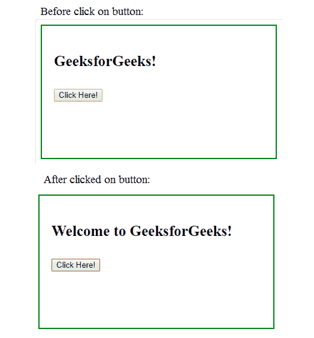

# jQuery | prependTo()带示例

> 原文:[https://www . geesforgeks . org/jquery-prepend to-with-examples/](https://www.geeksforgeeks.org/jquery-prependto-with-examples/)

prependTo()方法是 jQuery 中的一个内置方法，用于**在所选元素的开头插入 HTML 元素或一些内容。**

**语法:**

```
$(content).prepend(selector)
```

**参数:**该函数接受两个参数，如上所述，如下所述:

*   **内容:**为必输参数，用于指定要插入的内容。
*   **选择器:**必选参数，用于指定内容前置的元素。

**返回值:**该方法返回所选元素，其中包含通过 prependTo 方法进行的特定更改。
以下示例说明 jQuery 中的 prependTo()方法:
**示例:**

## 超文本标记语言

```
<!DOCTYPE html>
<html>
   <head>
       <title>The prependTo Method</title>
      <script src=
      "https://ajax.googleapis.com/ajax/libs/jquery/3.3.1/jquery.min.js">
      </script>

      <!-- jQuery code to show the working of this method -->
      <script>
         $(document).ready(function(){
             $("button").click(function(){
                 $("<span>Welcome to </span>").prependTo("p");
             });
         });
      </script>
      <style>
         div{
         width: 350px;
         min-height: 180px;
         font-weight: bold;
         padding:20px;
         font-size: 25px;
         border: 2px solid green;
         }
      </style>
   </head>
   <body>
      <div>

<p>GeeksforGeeks!</p>

         <!-- Click on this button to see the change -->
         <button >Click Here!</button>
      </div>
   </body>
</html>
```

**输出:**



**相关文章:**

*   [jQuery | addClass()带示例](https://www.geeksforgeeks.org/jquery-addclass-with-examples/)
*   [jQuery | find()带示例](https://www.geeksforgeeks.org/jquery-find-with-examples/)
*   [jQuery | clearQueue()带示例](https://www.geeksforgeeks.org/jquery-clearqueue-with-examples/)