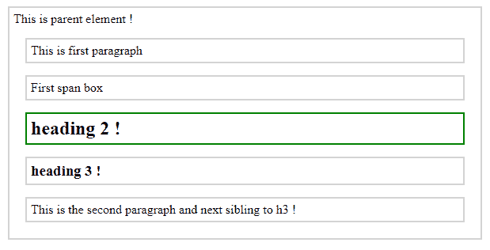
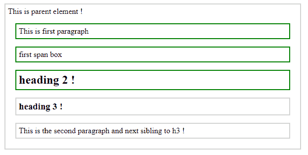

# jQuery | prev() & prevAll()带示例

> 原文:[https://www . geesforgeks . org/jquery-prev-prevall-with-examples/](https://www.geeksforgeeks.org/jquery-prev-prevall-with-examples/)

**prev()** 是 jQuery 中的一个内置函数，用于返回所选元素的前一个同级元素。兄弟是那些在 DOM 树中有相同父元素的元素。文档对象模型是为访问元素而定义的万维网联盟标准。

**预测()**

**语法:**

```html
$(selector).prev()

```

这里选择器是被选择的元素，它的前一个兄弟被返回。
**参数:**不接受任何参数。
**返回值:**返回所选元素的前一个同级。

<center>**jQuery code to show the working of prev() method:**</center>

**Code #1:**

```html
<html>

<head>
    <style>
        .pre * {
            display: block;
            border: 2px solid lightgrey;
            color: black;
            padding: 5px;
            margin: 15px;
        }
    </style>
    <script src="https://ajax.googleapis.com/ajax/libs/
                 jquery/3.3.1/jquery.min.js"></script>
    <script>
        $(document).ready(function() {
            $("h3").prev().css({
                "color": "black",
                "border": "2px solid green"
            });
        });
    </script>
</head>

<body class="pre">
    <div>
        This is parent element !
        <p>This is first paragraph </p>
        <span>First span box </span>
        <h2>heading 2 !</h2>
        <h3>heading 3 !</h3>
        <p>This is the second paragraph and next sibling to h3 !</p>
    </div>
</body>

</html>
```

在上面的代码中，“h3”的前一个兄弟元素用绿色突出显示。
**输出:**


**上一页全部（）**

**prevAll()** 是 jQuery 中的一个内置方法，用于返回所选元素的所有先前的兄弟元素。
**语法:**

```html
$(selector).prevAll()

```

这里选择器是被选择的元素，它的前一个兄弟被返回。
**参数:**不接受任何参数。
**返回值:**返回所选元素之前的所有兄弟元素。

<center>**jQuery code to show the working of prevAll() method:**</center>

**Code #2:**

```html
<html>

<head>
    <style>
        .preAll * {
            display: block;
            border: 2px solid lightgrey;
            color: black;
            padding: 5px;
            margin: 15px;
        }
    </style>
    <script src="https://ajax.googleapis.com/ajax/libs/
                jquery/3.3.1/jquery.min.js"></script>
    <script>
        $(document).ready(function() {
            $("h3").prevAll().css({
                "color": "black",
                "border": "2px solid green"
            });
        });
    </script>
</head>

<body class="preAll">
    <div>
        This is parent element !
        <p>This is first paragraph </p>
        <span>first span box </span>
        <h2>heading 2 !</h2>
        <h3>heading 3 !</h3>
        <p>This is the second paragraph and next
              sibling to h3 !</p>
    </div>
</body>

</html>
```

在上面的代码中，“h3”之前的所有兄弟元素都用绿色突出显示。
**输出:**
