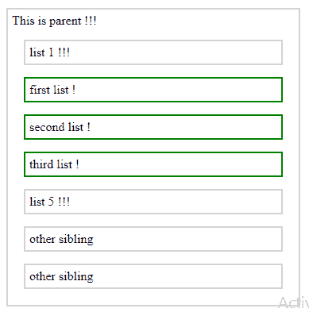

# jQuery | previtil()带示例

> 原文:[https://www . geeksforgeeks . org/jquery-prev till-with-examples/](https://www.geeksforgeeks.org/jquery-prevuntil-with-examples/)

**previtil()**是 jQuery 中的一个内置方法，用于查找两个给定元素之间所有先前的兄弟元素。兄弟是那些在 DOM 树中有相同父元素的元素。文档对象模型是一个万维网联盟标准。这定义了访问 DOM 树中的元素。
**语法:**

```
$(selector1).nextUntil(selector2)

```

**参数:**它接受一个参数“selector2”，这是最后一个选择的元素，在它之前会找到兄弟元素。
**返回值:**返回“选择符 1”和“选择符 2”之间的所有兄弟。

<center>**jQuery code to show the working of prevUntil() method:**</center>

**Code #1:**

```
<html>

<head>
    <style>
        .sib * {
            display: block;
            border: 2px solid lightgrey;
            color: black;
            padding: 5px;
            margin: 15px;
        }
    </style>
    <script src="https://ajax.googleapis.com/ajax/libs/
               jquery/3.3.1/jquery.min.js"></script>
    <script>
        $(document).ready(function() {
            $("li.start").prevUntil("li.stop").css({
                "color": "black",
                "border": "2px solid green"
            });
        });
    </script>
</head>

<body>
    <div style="width:400px;" class="sib">
        <ul>
            This is parent !!!
            <li class="stop">list 1 !!!</li>
            <li>first list !</li>
            <li>second list !</li>
            <li>third list !</li>
            <li class="start">list 5 !!!</li>
            <li>other sibling</li>
            <li>other sibling</li>
        </ul>
    </div>
</body>

</html>
```

在上面的代码中，“列表 5”和“列表 1”之间的所有先前的元素(或兄弟)都用绿色突出显示。
**输出:**


**代码#2:**

```
<html>

<head>
    <style>
        .sib * {
            display: block;
            border: 2px solid lightgrey;
            color: black;
            padding: 5px;
            margin: 15px;
        }
    </style>
    <script src="https://ajax.googleapis.com/ajax/libs/
           jquery/3.3.1/jquery.min.js"></script>
    <script>
        $(document).ready(function() {
            $("li.start").prevUntil("li.stop").css({
                "color": "black",
                "border": "2px solid green"
            });
        });
    </script>
</head>

<body>
    <div style="width:400px;" class="sib">
        <ul>
            This is parent !!!
            <li class="stop">list 1 !!!</li>
            <li>first list !</li>
            <li>second list !</li>
            <li>third list !</li>
            <li>fourth list !</li>
            <li>fifth list !</li>
            <li class="start">list 7 !!!</li>
        </ul>
    </div>
</body>

</html>
```

在上面的代码中，“列表 7”和“列表 1”之间的所有先前的元素(或兄弟)都用绿色突出显示。
**输出:**
