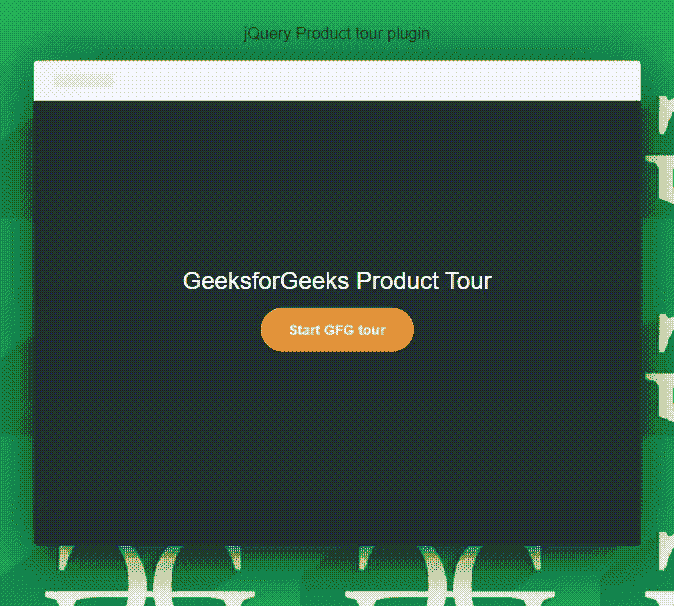

# jQuery | Product Tour Plugin

> 原文:[https://www.geeksforgeeks.org/jquery-product-tour-plugin/](https://www.geeksforgeeks.org/jquery-product-tour-plugin/)

jQuery **产品之旅**插件是一个轻量级的、反应灵敏的导游插件，为用户和程序员提供一步一步的指导，帮助他们了解产品或网站的用法。这是一个插件，用于为最终用户实现快速简单的帮助指南。它有助于为 web 应用程序生成移动友好的、可定制的分步指南。它为新用户提供了网络产品的“免费试用”版本，以收集更多关于该产品的知识。

**注意:**请从 [**产品游**插件](https://codyhouse.co/gem/product-tour)下载以下库文件，并保存在您的工作文件夹中，以包含在您的代码中。程序员可以根据项目需求改变路径和 CSS 文件。

**程序:**下面的例子演示了使用 CSS 和 javascript 代码开发的**产品游**插件的基本工作原理。HTML 页面由带有列表项的无序列表组成。每个列表项包含产品指南的一个步骤以及插件类，插件类控制属性，如标题、描述、手机图像和任何步骤的工具提示的位置。

```
<!DOCTYPE html>
<html lang="en" class="no-js">

<head>
    <meta charset="UTF-8">
    <meta name="viewport" content=
        "width=device-width, initial-scale=1">

    <link rel="stylesheet" href="css/reset.css">
    <link rel="stylesheet" href="css/style.css">
    <script src="js/modernizr.js"></script>

    <title>jQuery Product tour plugin</title>

    <style>
        body {
            text-align: center;
        }

        .height {
            height: 10px;
        }
    </style>
</head>

<body background="images/geeksImage1.png">
    <div class="height"></div><br />
    <b>jQuery Product tour plugin</b>

    <div class="cd-nugget-info">
        <h1>GeeksforGeeks Product Tour</h1>
        <button id="cd-tour-trigger" class="cd-btn">
            Start GFG tour
        </button>
    </div>

    <ul class="cd-tour-wrapper">
        <li class="cd-single-step">
            <span>Step 1</span>

            <div class="cd-more-info bottom">
                <h2><a href=
"https://www.geeksforgeeks.org/write-from-home-challenge-technical-content-writing-event-by-geeksforgeeks/">
                        Write From Home Challenge
                    </a>
                </h2>

                <p>
                    When the whole nation is on the verge
                    of lockdown due to COVID-19 pandemic 
                    and all Geeks across the country have 
                    to stay indoors, we at GeeksforGeeks
                    won’t let this outbreak to decrease 
                    your productivity anyhow. And, with 
                    the same concern, GeeksforGeeks is 
                    coming up with the Write From Home 
                    Challenge for you!
                </p>

                
            </div>
        </li> <!-- .cd-single-step -->

        <li class="cd-single-step">
            <span>Step 2</span>

            <div class="cd-more-info top">
                <h2><a href=
"https://www.geeksforgeeks.org/must-do-coding-questions-for-companies-like-amazon-microsoft-adobe/">
                        Must Do Coding Questions
                    </a>
                </h2>

                <p>
                    As the placement season is back so are we
                    to help you ace the interview. You can 
                    also take part in our mock placement 
                    contests which will help you learn different
                    topics and practice at the same time,
                    simulating the feeling of a real placement 
                    test environment.
                </p>
                
            </div>
        </li> <!-- .cd-single-step -->

        <li class="cd-single-step">
            <span>Step 3</span>

            <div class="cd-more-info right">
                <h2><a href=
"https://www.geeksforgeeks.org/what-is-artificial-intelligence-as-a-service-aiaas-in-the-tech-industry/">
                        What is Artificial Intelligence
                    </a>
                </h2>

                <p>
                    Software as a service, Infrastructure as
                    a service, Platform as a service, etc. 
                    are common services that everyone has 
                    heard of in the tech world. But what 
                    about Artificial Intelligence as a 
                    service?! Most companies these days use 
                    some sort of “as a service” to obtain 
                    services for a fee so that they can focus
                    on their core business. But AIaaS is 
                    relatively new and its emergence is due 
                    to the rising popularity of Artificial 
                    Intelligence in the IT industry.
                </p>

                
            </div>
        </li> <!-- .cd-single-step -->
    </ul> <!-- .cd-tour-wrapper -->

    <!-- used to create fake background app. -->
    <div class="cd-app-screen"></div>

    <div class="cd-cover-layer"></div>
    <script src="js/jquery-2.1.4.js"></script>
    <script src="js/jquery.mobile.min.js"></script>
    <!-- jQuery  resource library -->
    <script src="js/main.js"></script>
</body>

</html>
```

**输出:**

**输出为**
