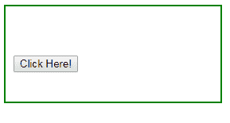
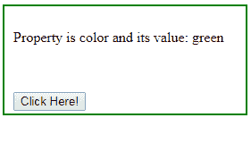

# jQuery | prop()带示例

> 原文:[https://www.geeksforgeeks.org/jquery-prop-with-examples/](https://www.geeksforgeeks.org/jquery-prop-with-examples/)

**prop()** 是 jQuery 中的一个内置方法，用于设置或返回所选元素的属性和值。当此方法用于返回属性值时，它返回第一个匹配元素的值，当此方法用于设置属性值时，它为所选元素设置一个或多个属性。
**语法:**

```html
$(selector).prop(para1, para2)

```

**参数:**它接受以下指定的两个参数-

*   **para1:** 指定属性。*   **para2:** It specifies the value of the property in case of set.

    **返回值:**返回所选元素的属性和值。

    **显示 prop()方法工作的 jQuery 代码:**

    ```html
    <html>
       <head>
          <script
          src="https://ajax.googleapis.com/ajax/libs/jquery/3.3.1/jquery.min.js">
          </script>
          <!-- jQuery code to show the working of this method -->
          <script>
             $(document).ready(function(){
                 $("button").click(function(){
                 var $x = $("p");
                 $x.prop("color", "green");
                 $x.append(" Property is color and its value: " + $x.prop("color"));

                 });
             });
          </script>
          <style>
             div{
             width: 250px;
             padding: 10px;
             height: 100px;
             border: 2px solid green;
             }
          </style>
       </head>
       <body>
          <div>
             <p></p>
             <br><br>
             <!-- click on button this method -->
             <button>Click Here!</button>
          </div>
       </body>
    </html>
    ```

    **输出:**
    点击【点击这里】按钮前-
    点击
    点击【点击这里】按钮后-
    