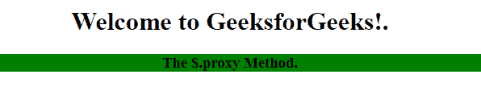
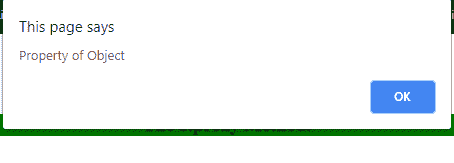
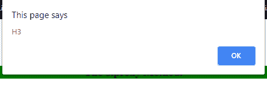
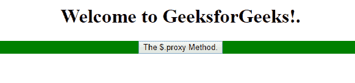
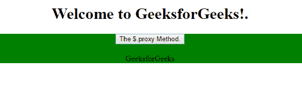

# jQuery | $。代理()方法

> 原文:[https://www.geeksforgeeks.org/jquery-proxy-method/](https://www.geeksforgeeks.org/jquery-proxy-method/)

**$。jQuery 中的 proxy()方法**接受一个现有的函数，并返回一个带有特定上下文的新函数。通常，它用于将事件附加到上下文指向不同对象的元素。

**语法:**

*   ```html
    $(selector).proxy(function, context)
    ```

*   ```html
    $(selector).proxy(context, name)
    ```

**参数:**该方法接受三个参数，如上所述，如下所述:

*   **函数:**保存要调用的已有函数名。
*   **上下文:**显示函数所在对象的名称。
*   **名称:**上下文要更改的函数。

**示例 1:** 本示例显示 h3 元素的上下文。

```html
<!DOCTYPE html>
<html>

<head>
    <title>
        jQuery $.proxy() Method
    </title>

    <script src=
"https://ajax.googleapis.com/ajax/libs/jquery/3.3.1/jquery.min.js">
    </script>

    <script>
        $(document).ready(function() {

            test = function() {
                this.txt = "Property of Object";
                $("h3").click($.proxy(this.myClick, this));
            };

            test.prototype.myClick = function(event) {
                alert(this.txt);
                alert(event.currentTarget.nodeName);
            };

            var x = new test();

        });
    </script>
</head>

<body style="text-align:center;">

    <h1>Welcome to GeeksforGeeks!.</h1> 

    <div style="background-color:green">
        <h3>Geeks for Geeks.</h3>    
    </div>
</body>

</html>
```

**输出:**

*   **点击标题文字 h3 前:**
    
*   **点击标题文字 h3 后:**
    
*   **点击确定按钮:**
    

**示例 2:** 本示例调用 objPerson 对象并显示其内容。

```html
<!DOCTYPE html>
<html>

<head>
     <title>
        jQuery $.proxy() Method
     </title>

    <script src=
"https://ajax.googleapis.com/ajax/libs/jquery/3.3.1/jquery.min.js">
    </script>

    <!-- Script to illustrate $.proxy() Method -->
    <script>
        $(document).ready(function(){
            var objPerson = {
                test: function() {
                    $("h2").after("GeeksforGeeks");
                }
            };

            $("button").click($.proxy(objPerson, "test"));
        });
    </script>
</head>

<body style="text-align:center;">

    <h1>Welcome to GeeksforGeeks!.</h1> 

    <div style="background-color:green">
        <button>The $.proxy Method.</button>        
        <h2></h2>  
    </div>
</body>

</html>
```

**输出:**

*   **点击按钮前:**
    
*   **点击按钮后:**
    