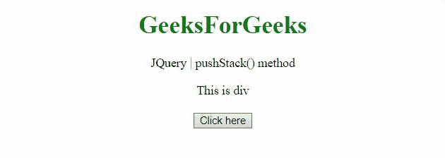
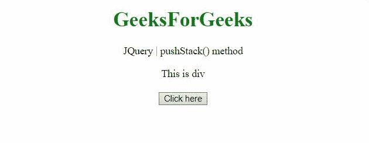

# jQuery pushStack()方法

> 原文:[https://www.geeksforgeeks.org/jquery-pushstack-method/](https://www.geeksforgeeks.org/jquery-pushstack-method/)

jQuery 中的 **pushStack()** 方法用于将 DOM 元素的集合添加到 jQuery 堆栈中。

**语法:**

```html
.pushStack(elements, name, arguments)
```

**参数:**

*   **元素:**这是要推送到堆栈上并组成新 jQuery 对象的元素数组。
*   **名称:**该参数定义了生成元素数组的 jQuery 方法的名称。
*   **参数:**传递给 jQuery 方法进行序列化的参数。

**例 1:**

```html
<!DOCTYPE HTML>
<html>

<head>
    <title>
        JQuery pushStack() method
    </title>

    <script src=
"https://code.jquery.com/jquery-3.5.0.js">
    </script>
</head>

<body style="text-align:center;">

    <h1 style="color:green;">
        GeeksForGeeks
    </h1>

    <p>
        JQuery | pushStack() method
    </p>

    <div> 
        This is div
    </div>
    <br>

    <button onclick="Geeks()">
        Click here
    </button>

    <p id="GFG"></p>

    <script>
        var el_down = document.getElementById("GFG");

        function Geeks() {
            jQuery([]).pushStack(
                document.getElementsByTagName("div"))
                .remove().end();

            el_down.innerHTML
                = "The DOM element <div> has "
                    + "been pushed to stack and then"
                    + " removed.";
        } 
    </script>
</body>

</html> 
```

*   **输出:**
    
    *   **示例 2:** 本示例选中了奇数索引复选框。

        ```html
        <!DOCTYPE HTML>
        <html>

        <head>
            <title>
                JQuery pushStack() method
            </title>

            <script src=
        "https://code.jquery.com/jquery-3.5.0.js">
            </script>
        </head>

        <body style="text-align:center;">

            <h1 style="color:green;">
                GeeksForGeeks
            </h1>

            <p>JQuery | pushStack() method</p>

            <div>This is div</div>
            <br>

            <button onclick="Geeks()">
                Click here
            </button>

            <div id="GFG"></div>

            <script>

                var el_down = document.getElementById("GFG");

                function Geeks() {
                    jQuery([]).pushStack(
                        document.getElementsByTagName("p"))
                        .remove().end();

                    el_down.innerHTML = "The DOM element "
                        + "<p> containing 'JQuery |"
                        + " pushStack() method has been "
                        + "pushed to stack and then removed.";
                } 
            </script>
        </body>

        </html>
        ```

    *   **输出:**
        