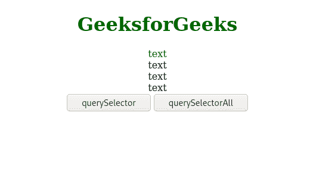

# jQuery querySelector()与 querySelectorAll()方法

> 哎哎哎:# t0]https://www . geeksforgeeks . org/jquery-query selector-vs-query selectorall 方法/

**querySelector()** 和 **querySelectorAll()** 是两个 jQuery 函数，通过使用 CSS 选择器*帮助 HTML 元素作为参数传递(【id】，【class】)*可以选择。

**querySelector()方法:****query selector()**方法返回文档中与指定 CSS 选择器匹配的第一个元素。如果出现多个元素，则只返回第一个匹配元素的结果。

**语法:**

```html
document.querySelector(selectors);
```

它返回与选择器匹配的第一个元素。

**querySelectorAll()方法:****query selectorall()**方法返回文档中与指定 CSS 选择器匹配的所有元素。它以静态节点列表对象的形式返回与选择器匹配的所有元素，该对象是节点的集合。为了访问每个元素，我们通常使用一个循环。每个元素都可以通过索引来访问。索引从 0 开始。属性*长度*可用于获取与指定选择器匹配的元素数量。

**语法:**

```html
document.querySelectorAll(selectors);
```

它返回与选择器匹配的所有元素。

```html
document.querySelectorAll(selectors)[i];
```

它返回列表中索引 *i* 处的元素。

【querySelector()和 querySelectorAll()方法的区别:

**HTML 代码:**

## 超文本标记语言

```html
<!DOCTYPE html>
<html>

<body style="text-align:center;">

    <h1 style="color:#006600">
        GeeksforGeeks
    </h1>

    <div class="test-btn">text</div>
    <div class="test-btn">text</div>
    <div class="test-btn">text</div>
    <div class="test-btn">text</div>

    <button onClick="qselector()">
        querySelector
    </button>

    <button onClick="qselectorall()">
        querySelectorAll
    </button>

    <script>
        function qselector() {
            document.querySelector(".test-btn")
                .style.color = "#006600";
        }

        function qselectorall() {
            var x = document
                .querySelectorAll(".test-btn");

            for (var i = 0; i < x.length; i++) {
                x[i].style.color = "#006600";
            }
        } 
    </script>
</body>

</html>
```

**输出:**

*   **点击任意按钮前:** 
*   **点击查询后选择按钮:** 
*   **点击查询后选择所有按钮:** 

**区别:**如上所述， **querySelector()方法**只能用于访问单个元素，而 **querySelectorAll()方法**可以用于访问与指定 CSS 选择器匹配的所有元素。要返回所有匹配，必须使用**查询选择所有**，而要返回单个匹配，则使用**查询选择**。