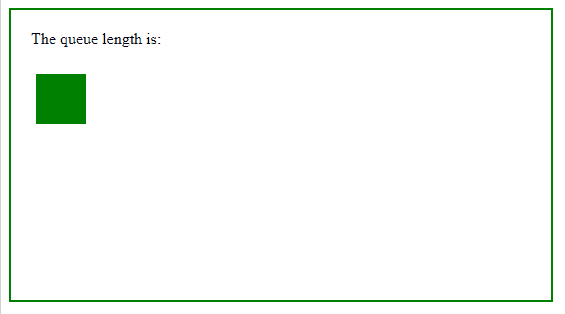
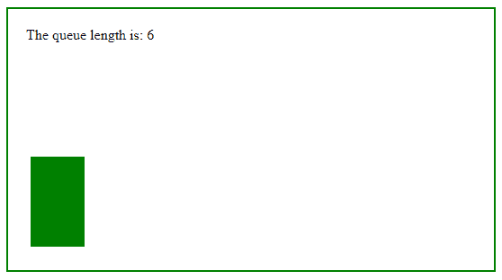

# jQuery | queue()带示例

> 原文:[https://www.geeksforgeeks.org/jquery-queue-with-examples/](https://www.geeksforgeeks.org/jquery-queue-with-examples/)

queue()方法是 jQuery 中的一个内置方法，用于显示要在所选元素上执行的函数队列。队列中有一个或多个函数等待运行。

*   queue()方法可以与 queue()方法一起使用。
*   一个元素可能有几个队列。通常只有一个默认的 jQuery 队列。

**语法:**

```
$(selector).queue(queue_name)
```

**参数:**此方法接受单参数 *queue_name* ，可选。它用于设置队列名称。

下面的例子说明了 jQuery 中的 queue()方法:

**示例:**

```
<!DOCTYPE html>
<html>
    <head>
        <title>The queue Method</title>
        <script src=
        "https://ajax.googleapis.com/ajax/libs/jquery/3.3.1/jquery.min.js">
        </script>

        <!-- jQuery code to show the working of this method -->
        <script>
            $(document).ready(function() {
                $("p").click(function() {
                    var div = $("div");

                    div.animate({
                        left: "+=200"
                    }, 2000);
                    div.animate({
                        height: 200
                    }, "slow");
                    div.animate({
                        width: 150
                    }, "slow");
                    div.animate({
                        height: 100
                    }, "slow");
                    div.animate({
                        width: 60
                    }, "slow");
                    div.animate({
                        left: "-=200",
                        top: "+=100"
                    }, 2000);

                    $("span").text(div.queue().length);
                });
            });
        </script>
        <style>
            div {
                width: 50px;
                height: 50px;
                position: absolute;
                left: 35px;
                margin-top: 10px;
                background-color: green;
            }

            body {
                width: 500px;
                height: 250px;
                border: 2px solid green;
                padding: 20px;
            }
        </style>
    </head>

    <body>
        <p>The queue length is: <span></span></p>

        <!-- click on above paragraph to show the
        number of times animation method works -->
        <div></div>
    </body>
</html>
```

**输出:**
之前点击段落元素:
T5【之后点击段落元素:
