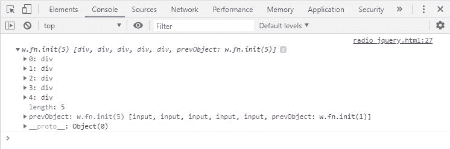
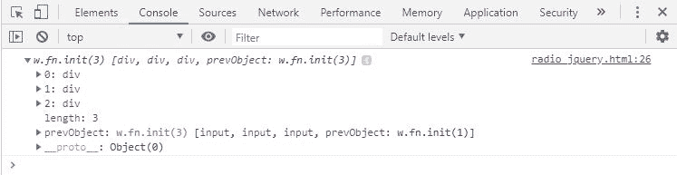

# jQuery |:单选选择器

> 原文:[https://www.geeksforgeeks.org/jquery-radio-selector/](https://www.geeksforgeeks.org/jquery-radio-selector/)

**:收音机选择器**用于选择收音机类型的所有元件。 **$(“:电台”)**和**$(“[type =电台]”**的工作原理相同。
选择表单中使用的一组单选按钮，我们使用**$(【input[name = name _ of _ group]:radio】)**
它返回一个 radio 类型的输入元素数组。

**语法:**

*   **默认语法:**

    ```
     $( "input[name=group_name]:radio" ) 
    ```

*   **用于利用优势的语法:**上面的语法不能利用本机 DOM 的性能优化，所以请改用下面的语法。

    ```
     $("input[type=radio][name=group-1]") 
    ```

**方法-1: $(“输入[type = radio]”**这种选择方法选择 radio ie 类型的所有输入元素。页面的每个无线电元素。
**例-1:**

```
<!DOCTYPE html>
<html lang="en">

<head>
    <meta charset="UTF-8">
    <meta name="viewport" 
          content="width=device-width,
                   initial-scale=1.0">
    <meta http-equiv="X-UA-Compatible" 
          content="ie=edge">
    <title>Document</title>
</head>

<body>
    <form action="">
        <input type="text"
               name="name" />
        <input type="radio" 
               name="group-1" />
        <input type="radio" 
               name="group-1" />
        <input type="radio"
               name="group-1" />

        <input type="radio"
               name="group-2" />
        <input type="radio"
               name="group-2" />
    </form>
</body>
<script src=
"https://ajax.googleapis.com/ajax/libs/jquery/3.3.1/jquery.min.js">
  </script>

  <script>
    $(document).ready(function() {
        var input = $("input[type=radio]").wrap(
          "<div></div>").parent().css({
            background: "green",
            display: "inline"
        })
        console.log(input)
    });
</script>

</html>
```

**控制台**

**输出:**


**方法 2- $(“输入:单选”)**这将产生与前一个相同的结果。
T3】例 2:

```
<!DOCTYPE html>
<html lang="en">
<head>
    <meta charset="UTF-8">
    <meta name="viewport" content="width=device-width, initial-scale=1.0">
    <meta http-equiv="X-UA-Compatible" content="ie=edge">
    <title>Document</title>
</head>
<body>
    <form action="">
        <input type="text" name="name"/>
        <input type="radio" name="group-1" />
        <input type="radio" name="group-1" />
        <input type="radio" name="group-1" />

        <input type="radio" name="group-2"/>
        <input type="radio" name="group-2"/>
    </form>
</body>
<script src=
"https://ajax.googleapis.com/ajax/libs/jquery/3.3.1/jquery.min.js">
</script>
<script>
    $(document).ready(function(){
        var input=$("input:radio").wrap(
        "<div></div>").parent().css({
        background:"green",
        display:"inline"
    })
    console.log(input)
    });
</script>
</html>
```

**输出:**


**方法-3: $(【输入[type = radio][name = group-1])**这将从表单中选择指定的一组无线电输入。
**例-3:**

```
<!DOCTYPE html>
<html lang="en">

<head>
    <meta charset="UTF-8">
    <meta name="viewport"
          content="width=device-width, 
                   initial-scale=1.0">
    <meta http-equiv="X-UA-Compatible"
          content="ie=edge">
    <title>Document</title>
</head>

<body>
    <form action="">
        <input type="text" 
               name="name" />
        <input type="radio" 
               name="group-1" />
        <input type="radio"
               name="group-1" />
        <input type="radio"
               name="group-1" />

        <input type="radio" 
               name="group-2" />
        <input type="radio"
               name="group-2" />
    </form>
</body>
<script src=
"https://ajax.googleapis.com/ajax/libs/jquery/3.3.1/jquery.min.js">
  </script>
<script>
    $(document).ready(function() {
        var input = 
          $("input[type=radio][name=group-1]").wrap(
          "<div></div>").parent().css({
            background: "yellow",
            display: "inline"
        })
        console.log(input)
    }); 

  </script>
  </html>
```

**控制台:** 

**输出:**
