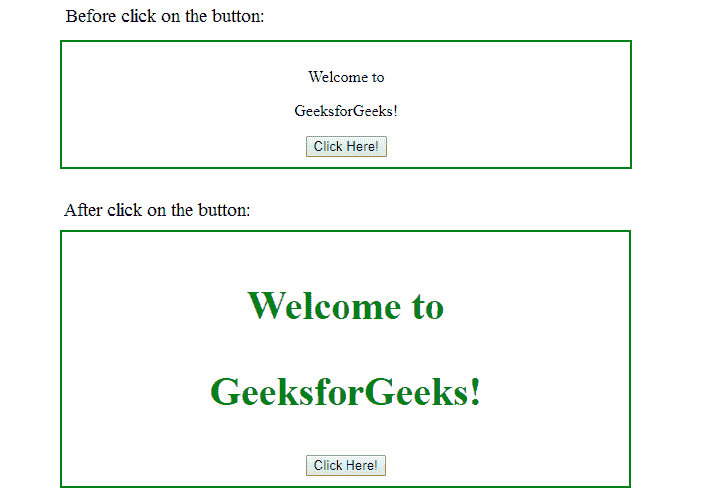

# jQuery | ready()带示例

> 原文:[https://www.geeksforgeeks.org/jquery-ready-with-examples/](https://www.geeksforgeeks.org/jquery-ready-with-examples/)

ready()方法是 jQuery 中的一个内置方法，它有助于加载整个页面，然后执行剩下的代码。这个方法指定当 DOM 完全加载时要执行的函数。

**语法:**

```
$(document).ready(function)
```

**参数:**该方法接受单参数*功能*，该功能为必选项。它用于指定加载文档后运行的函数。

**返回值:**该方法执行 ready()方法后返回文档。
下面的例子说明了 jQuery 中的 ready()方法:

**示例:**

```
<!DOCTYpe html>
<html>
    <head>
        <title>The ready Method</title>
        <script src=
        "https://ajax.googleapis.com/ajax/libs/jquery/3.3.1/jquery.min.js">
        </script>

        <!-- jQuery code to show the working of this method -->
        <script>
            $(document).ready(function(){
                $("button").click(function(){
                     $("p").css("color", "green");
                     $("p").css("font-size", "40px");
                     $("p").css("font-weight","bold")
                 });
         });
      </script>
      <style>
         div {
             text-align:center;
             width: 60%;
             min-height: 100px;
             padding: 10px;
             border: 2px solid green;
         }
      </style>
   </head>
   <body>
      <div>
         <p>Welcome to</p>
         <p>GeeksforGeeks!</p>
         <!-- click on this button -->
         <button>Click Here!</button>
      </div>
   </body>
</html>
```

**输出:**
