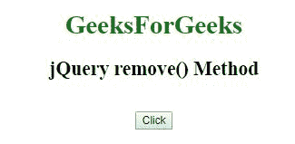
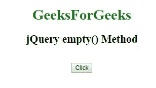

# jQuery |移除元素

> 原文:[https://www.geeksforgeeks.org/jquery-remove-elements/](https://www.geeksforgeeks.org/jquery-remove-elements/)

在 jQuery 中，为了删除元素和内容，您可以使用以下两种 jQuery 方法中的任何一种:
**方法:**

*   **移除()**–用于移除所选元素(及其子元素)。
*   **空()**–用于从所选元素中移除子元素。

**示例-1:** 使用 jQuery remove()方法。

```html
<!DOCTYPE html>
<html>

<head>
    <title>jQuery remove() Method</title>

  <script src=
"https://ajax.googleapis.com/ajax/libs/jquery/3.3.1/jquery.min.js">
  </script>
</head>

<body>
    <center>
        <h1 style="color:green;">  
            GeeksForGeeks</h1>
        <h2 id="GFG">
          jQuery remove() Method</h2>
        <br>
        <button>Click</button>
        <script>
            $(document).ready(function() {
                $("button").click(function() {
                    $("#GFG").remove();
                });
            });
        </script>
    </center>
</body>

</html>
```

**输出:**

**之前点击按钮:**


**点击按钮后:**


**示例-2:** 使用 jQuery 空()方法。

```html
<!DOCTYPE html>
<html>

<head>
    <title>jQuery empty() Method
  </title>
    <script src=
"https://ajax.googleapis.com/ajax/libs/jquery/3.3.1/jquery.min.js">
  </script>
</head>

<body>
    <center>
        <h1 style="color:green;">  
            GeeksForGeeks</h1>
        <h2 id="GFG"> jQuery empty() Method
      </h2>
        <br>
        <button>Click</button>
        <script>
            $(document).ready(function() {
                $("button").click(function() {
                    $("#GFG").empty();
                });
            });
        </script>
    </center>
</body>

</html>
```

**输出:**

**之前点击按钮:**


**点击按钮后:**
