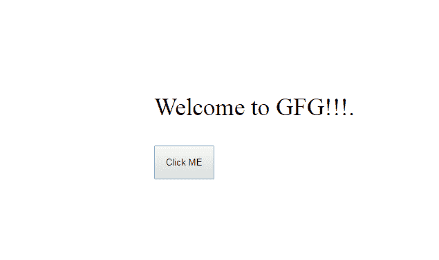
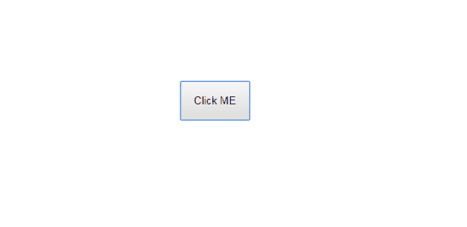
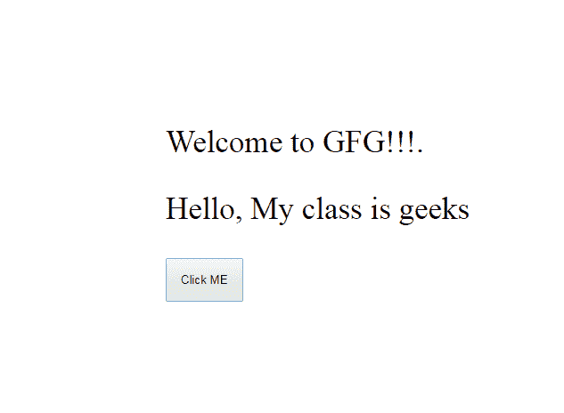
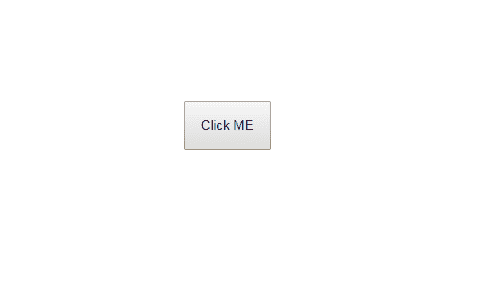

# jQuery | remove()

> 原文:[https://www.geeksforgeeks.org/jquery-remove/](https://www.geeksforgeeks.org/jquery-remove/)

**JQuery** 中的 **remove()** 方法用于移除包括所有文本在内的所有选定元素。此方法还会移除选定元素的数据和所有事件。
**语法:**

```
$(selector).remove()

```

**返回值:**将返回所选删除元素的所有数据。
T3】例 1:

```
Input: $("p").remove()
Output: Output will be all the elements of the paragraph get deleted.
```

**代码 1:**

```
<html>

<head>
    <script src="https://ajax.googleapis.com/ajax/
                 libs/jquery/3.3.1/jquery.min.js">
        //this is JQuery CDN directed from the JQuery website
    </script>
    <script>
        $(document).ready(function() {
            $("button").click(function() {
                $("p").remove();
            });
        });
    </script>
</head>

<body>
    <div style="padding-left:220px;padding-top:100px;">
        <p style="font-size:35px;">Welcome to GFG!!!.</p>
        <button style="padding:15px;">Click ME</button>
    </div>
</body>

</html>
```

**输出:**
点击按钮前:

点击按钮后:

我们还可以借助**JQuery****remove()**方法使用其类名查找并移除元素。
**语法:**

```
$(".class_name").remove()

```

**返回值:**将返回页面上删除的所有部分，带有类名。
T3】例 2:

```
Input: $(".geek").remove()
Output: Here "gfg!!!" get deleted. 
```

**代码#2:**

```
<html>

<head>
    <script src="https://ajax.googleapis.com/ajax/libs
                /jquery/3.3.1/jquery.min.js">
        //this is JQuery CDN directed from the JQuery website
    </script>
    <script>
        $(document).ready(function() {
            $("button").click(function() {
                $(".geeks").remove();
            });
        });
    </script>
</head>

<body>
    <div style="margin-left:180px; font-size:35px;padding-top:100px">
        <p class="geeks">Welcome to GFG!!!.</p>
        <p class="geeks">Hello, My class is geeks</p>
        <button>Click ME</button>
    </div>
</body>

</html>
```

**输出:**
点击按钮前:

点击按钮后:

除按钮外的所有内容都被移除