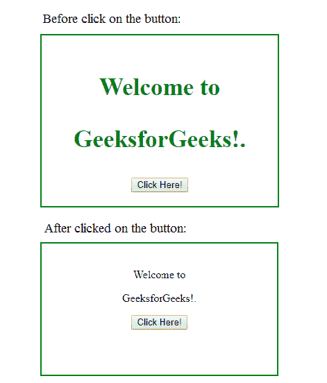

# jQuery | removeAttr()带示例

> 原文:[https://www . geesforgeks . org/jquery-removeattr-with-examples/](https://www.geeksforgeeks.org/jquery-removeattr-with-examples/)

removeAttr()方法是 jQuery 中的一个内置方法，用于**从所选元素中移除一个或多个属性。**

**语法:**

```
$(selector).removeAttr(attribute)
```

**参数:**该功能接受单参数*属性*，该属性为必选项。它用于指定要移除的一个或多个属性。使用空间运算符可以分隔多个属性。

**返回值:**该方法返回已删除属性的选定元素。

下面的示例说明了 jQuery 中的 removeAttr()方法:

**示例:**

```
<!DOCTYPE html>
<html>
   <head>
       <title>The removeAttr Method</title>
       <script src=
       "https://ajax.googleapis.com/ajax/libs/jquery/3.3.1/jquery.min.js">
       </script>

        <!-- jQuery code to show the working of this method -->
       <script>
            $(document).ready(function() {
            $("button").click(function() {
                 $("p").removeAttr("style");
             });
         });
      </script>
      <style>
         div {
             width: 300px;
             min-height: 150px;
             border: 2px solid green;
             padding: 20px;
             text-align:center;
         }
      </style>
   </head>
   <body>
      <div>
         <!-- click on the any of the paragraph
         and see the change -->
         <p style="font-size:35px;font-weight:bold;
                       color:green;">Welcome to</p>
         <p style="font-size:35px;font-weight:bold;
                  color:green;">GeeksforGeeks!.</p>
         <button>Click Here!</button>
      </div>
   </body>
</html>
```

**输出:**


jQuery 是一个开源的 JavaScript 库，它简化了 HTML/CSS 文档之间的交互，它以其“少写多做”的理念而闻名。
跟随本 [jQuery 教程](https://www.geeksforgeeks.org/jquery-tutorials/)和 [jQuery 示例](https://www.geeksforgeeks.org/jquery-examples/)可以从头开始学习 jQuery。