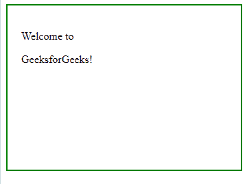

# jQuery | removeClass()带示例

> 原文:[https://www . geeksforgeeks . org/jquery-remove class-with-examples/](https://www.geeksforgeeks.org/jquery-removeclass-with-examples/)

removeClass()方法是 jQuery 中的一个内置方法，用于从所选元素中移除一个或多个类名。

**语法:**

```
$(selector).removeClass(class_name, function(index, current_class_name))
```

**参数:**该函数接受两个参数，如上所述，如下所述:

*   **类名:**可选参数，用于指定要删除的类名(一个或多个类)。用空格分隔的多个类名。
*   **函数:**为可选参数，返回一个或多个需要删除的类名。
    *   **索引:**此参数用于返回元素的索引。
    *   **current_class_name:** 此参数返回所选元素的类名。

**返回值:**该方法返回带有指定移除类名的选定元素。

以下示例说明了 jQuery 中的 removeClass()方法:

**例 1:**

```
<html>
    <head>
        <title>The removeClass Method</title>
        <script src=
        "https://ajax.googleapis.com/ajax/libs/jquery/3.3.1/jquery.min.js">
        </script>

        <!-- jQuery code to show the working of this method -->
        <script>
            $(document).ready(function() {
                $("p").click(function() {
                    $("p").removeClass("GFG");
                });
            });
        </script>
        <style>
            .GFG {
                font-size: 120%;
                color: green;
                font-weight: bold;
                font-size: 35px;
            }
            div {
                width: 50%;
                height: 200px;
                padding: 20px;
                border: 2px solid green;
            }
        </style>
    </head>

    <body>
        <div>
            <!-- click on any paragraph and see the change -->
            <p class="GFG">Welcome to</p>
            <p class = "GFG">GeeksforGeeks</p>
        </div>
    </body>
</html>
```

**输出:**
前点击段:
后点击段:


**例 2:** 本例不包含参数。这将删除所选元素的所有类。

```
<!DOCTYPE html>
<html>
    <head>
        <title>The removeClass Method</title>
        <script src=
        "https://ajax.googleapis.com/ajax/libs/jquery/3.3.1/jquery.min.js">
        </script>

        <!-- jQuery code to show the working of this method -->
        <script>
            $(document).ready(function() {
                $("p").click(function() {
                    $("p").removeClass();
                });
            });
        </script>
        <style>
            .GFG {
                font-size: 120%;
                color: green;
                font-weight: bold;
                font-size: 35px;
            }

            div {
                width: 300px;
                height: 200px;
                padding: 20px;
                border: 2px solid green;
            }
        </style>
    </head>
    <body>
        <div>

            <!-- click on any paragraph and see the change -->
            <p class="GFG">Welcome to </p>
            <p class="GFG">GeeksforGeeks!</p>

        </div>
    </body>
</html>
```

**输出:**
前点击段:
后点击段:


**相关文章:**

*   [jQuery | not()方法示例](https://www.geeksforgeeks.org/jquery-not-method-with-examples/)
*   [jQuery |最后()举例](https://www.geeksforgeeks.org/jquery-last-with-examples/)