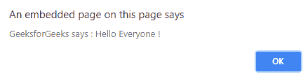
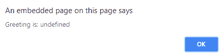

# jQuery | removeData()带示例

> 原文:[https://www . geesforgeks . org/jquery-remove data-with-examples/](https://www.geeksforgeeks.org/jquery-removedata-with-examples/)

**removeData()** 是 jQuery 中的一个内置方法，用于**移除之前用 Data()方法设置的那些数据。**
**语法:**

```
$(selector).removeData(args);

```

这里的“选择器”是其先前设置的数据被移除的所选元素。
**参数:**它接受一个可选参数“args”，该参数指定要为所选元素移除的数据的名称。
**返回值:**返回已删除数据的选中元素。

<center>**jQuery code to show the working of removeData() method:**</center>

**Code #1:**
In the below code, the data get removed by removeData() method set by the data() method.

```
<html>

<head>
    <script src="https://code.jquery.com/jquery-1.10.2.js">
    </script>
    <script>
        <!-- working of remove data method -->
        $(document).ready(function() {
            <!-- click here to add data to div element -->
            $("#b1").click(function() {
                $("div").data("greeting", "Hello Everyone !");
                alert("GeeksforGeeks says : " + $("div").
                         data("greeting"));
            });
            <!-- click here to remove data from div element -->
            $("#b2").click(function() {
                $("div").removeData("greeting");
                alert("Greeting is: " + $("div").
                        data("greeting"));
            });
        });
    </script>
    <style>
        #b1,
        #b2 {
            padding: 10px;
            margin: 20px;
            background-color: green;
        }
    </style>
</head>

<body>
    <button id="b1">Click here to add data to 
                     div element</button>
    <br>
    <button id="b2">Click here to Remove data 
                    from div element</button>
    <div></div>
</body>

</html>
```

**输出:**
附加数据后-
T5】移除数据后-
