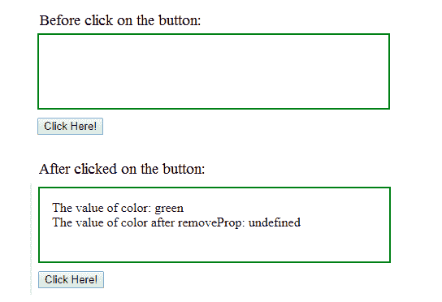

# jQuery | removeProp()带示例

> 原文:[https://www . geesforgeks . org/jquery-remove prop-with-examples/](https://www.geeksforgeeks.org/jquery-removeprop-with-examples/)

removeProp()方法是 jQuery 中的一个内置方法，用于**移除 Prop()方法**设置的属性。prop()方法用于向选定的元素添加属性。

**语法:**

```
$(selector).removeProp(property)
```

**参数:**该方法接受单参数*属性*，该属性为必选项。它用于指定需要移除的属性的名称。

**返回值:**该方法返回删除了指定属性的选定元素。

下面的例子说明了 jQuery 中的 removeProp()方法:

**示例:**

```
<!DOCTYPE html>
<html>
    <head>
        <title>The removeProp Method</title>
        <script src=
        "https://ajax.googleapis.com/ajax/libs/jquery/3.3.1/jquery.min.js">
        </script>

        <!-- jQuery code to show the working of this method -->
        <script>
            $(document).ready(function() {
                $("button").click(function() {
                    var $GFG = $("div");
                    $GFG.prop("color", "green");
                    $GFG.append("The value of color: "
                                     + $GFG.prop("color"));
                    $GFG.removeProp("color");
                    $GFG.append("<br>The value of color after removeProp: " 
                                            + $GFG.prop("color") + "<br>");
                });
            });
        </script>
        <style>
            div {
                width: 400px;
                min-height: 60px;
                padding: 15px;
                border: 2px solid green;
                margin-bottom: 10px;
            }
        </style>
    </head>
    <body>

        <div></div>
        <!-- click on this button -->
        <button>Click Here!</button>
        <br>
        <br>
    </body>
</html>
```

**输出:**
