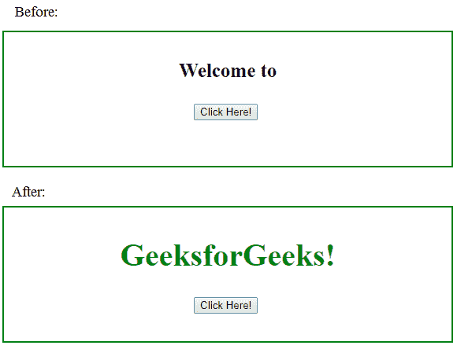

# jQuery |用示例替换所有()

> 原文:[https://www . geeksforgeeks . org/jquery-replace all-with-examples/](https://www.geeksforgeeks.org/jquery-replaceall-with-examples/)

replaceAll()方法是 jQuery 中的一个内置方法，用于用新的 HTML 元素替换选定的元素。

**语法:**

```
$(content).replaceAll(selector)
```

**参数:**该方法接受两个参数，如上所述，如下所述:

*   **内容:**是指定要插入内容的必选参数。
*   **选择器:**是指定要替换的元素的必需参数。

**返回值:**该方法返回新内容的选中元素。

下面的程序说明了上面的功能:

**程序:**

```
<!DOCTYPE html>
<html>
    <head>
        <title>The replaceAll Method</title>
        <script src=
        "https://ajax.googleapis.com/ajax/libs/jquery/3.3.1/jquery.min.js">
        </script>

        <!-- jQuery code to show the working of this method -->
        <script>
            $(document).ready(function() {
                $("button").click(function() {
                    $("<h1>GeeksforGeeks!</h1>").replaceAll("p");
                    $("h1").css({"color":"green"});
                });
            });
        </script>
        <style>
            div {
                width: 60%;
                height: 150px;
                padding: 10px;
                border: 2px solid green;
                font-size: 20px;
                text-align:center;
            }
            p {
                font-size:25px;
                font-weight:bold;
            }
        </style>
    </head>
    <body>
        <div>
            <p>Welcome to </p>

            <!-- click on this button and see the change -->
            <button>Click Here!</button>
            <br>
        </div>
    </body>
</html>
```

**输出:**
