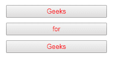
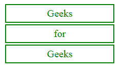
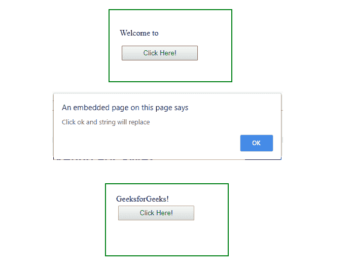

# jQuery |用示例替换 With()

> 原文:[https://www . geeksforgeeks . org/jquery-replace with-with-examples/](https://www.geeksforgeeks.org/jquery-replacewith-with-examples/)

replaceWith()方法是 jQuery 中的一个内置方法，用于用新的元素替换选定的元素。

**语法:**

```
$(selector).replaceWith(content, function)
```

**参数:**该方法接受两个参数，如上所述，如下所述:

*   **内容:**必选参数，用于指定需要替换的内容。
*   **para2:** 是可选参数，调用后执行。

**返回值:**该方法返回有变化的选中元素。

下面的代码说明了 jQuery 中的 replaceWith()方法:

**例 1:**

```
<!DOCTYPE html>
<html>
    <head>
        <title>The replaceWith method</title>
        <script src=
        "https://ajax.googleapis.com/ajax/libs/jquery/3.3.1/jquery.min.js">
        </script>
        <style>
            button {
                display: block;
                margin: 10px;
                color: red;
                width: 200px;
                padding: 3px;
            }
            div {
                color: green;
                border: 2px solid green;
                width: 200px;
                margin: 3px;
                padding: 5px;
                font-size: 20px;
                text-align: center;
            }
        </style>
    </head>
    <body>
        <!-- click on individual button and see the change -->
        <button>Geeks</button>
        <button>for</button>
        <button>Geeks</button>

        <!-- jQuery code to show the working of this method -->
        <script>
            $("button").click(function() {
                $(this).replaceWith("<div>" + $(this).text() + "</div>");
            });
        </script>
    </body>
</html>
```

**输出:**
之前点击任意按钮:

之后点击所有按钮:


**例 2:** 在下面的代码中可选函数被传递。

```
<!DOCTYPE html>
<html>
    <head>
        <title>The replaceWith method</title>
        <script src=
        "https://ajax.googleapis.com/ajax/libs/jquery/3.3.1/jquery.min.js">
        </script>
        <style>
            button {
                display: block;
                margin: 4px;
                color: green;
                width: 150px;
                padding: 5px;
            }
            div {
                width: 200px;
                height: 100px;
                padding: 20px;
                border: 2px solid green;
            }
        </style>
    </head>
    <body>
        <div>
            <p>Welcome to </p>

            <!-- click on this button and see the change -->
            <button>Click Here!</button>
        </div>

        <!-- jQuery code to show the working of this method -->
        <script>
            var x = "GeeksforGeeks!";
            $("button").click(function() {
                $("p").replaceWith(x).replaceWith(function(n) {
                    alert("Click ok and string will replace");
                    return n;
                });
            });
        </script>
    </body>
</html>
```

**输出:**
