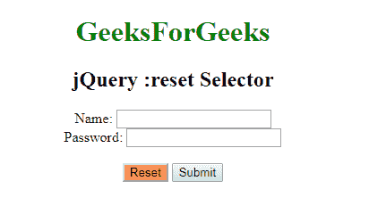

# jQuery |:重置选择器

> 原文:[https://www.geeksforgeeks.org/jquery-reset-selector/](https://www.geeksforgeeks.org/jquery-reset-selector/)

**:复位选择器**用于选择具有复位字段按钮的输入元素，即<输入类型=“按钮”>。

**语法:**

```html
$(":reset")
```

**示例:**

```html
<!DOCTYPE html>
<html>

<head>
    <script src=
"https://ajax.googleapis.com/ajax/libs/jquery/3.3.1/jquery.min.js">
  </script>

    <script>
        $(document).ready(function() {
            $(":reset").css("background-color",
                            "coral");
        });
    </script>
</head>

<body>
    <center>
        <h1 style="color:green;">
          GeeksForGeeks
      </h1>

        <h2>jQuery :reset Selector
      </h2>

        <form action="#">
            Name:
            <input type="text" 
                   name="user">
            <br> Password:
            <input type="password" 
                   name="password">
            <br>
            <br>
            <input type="reset" 
                   value="Reset">
            <input type="submit" 
                   value="Submit">
            <br>
        </form>
  </center>
</body>

</html>
```

**输出:**


**支持的浏览器:**支持的浏览器 **jQuery:重置选择器**如下:

*   谷歌 Chrome
*   微软公司出品的 web 浏览器
*   火狐浏览器
*   歌剧
*   旅行队