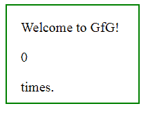
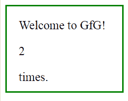

# jQuery | resize()示例

> 原文:[https://www.geeksforgeeks.org/jquery-resize-with-examples/](https://www.geeksforgeeks.org/jquery-resize-with-examples/)

resize()方法是 jQuery 中的一个内置方法，在浏览器窗口改变大小时使用。

**语法:**

```
$(selector).resize(function)
```

**参数:**该方法接受单参数*功能*，可选。它用于指定调用 resize 事件时要运行的函数。

**返回值:**该方法返回所选元素，并增加其大小。

以下示例说明了 jQuery 中的 resize()方法:

**示例:**

```
<!DOCTYPE html>
<html>
    <head>
        <title>The resize method</title>
        <script src=
        "https://ajax.googleapis.com/ajax/libs/jquery/3.3.1/jquery.min.js">
        </script>

        <!-- jQuery code to show the working of this method -->
        <script>
            x = 0;
            $(document).ready(function() {
                $(window).resize(function() {
                    $("p").text(x += 1);
                });
            });
        </script>
        <style>
            div {
                width: 150px;
                height: 100px;
                padding: 20px;
                border: 2px solid green;
                font-size: 20px;
            }
        </style>
    </head>

    <body>
        <div>
            <!-- press "ctrl" and "+" key together
            and see the effect -->
            Welcome to GfG!
            <br>
            <p>0</p>
            times.
        </div>
    </body>
</html>
```

**输出:**
在点击任何东西之前。

点击 2 次后“ctrl”和“+”键一起出现在键盘上。
