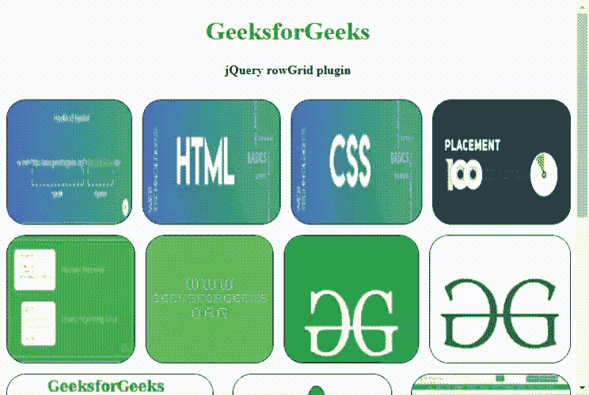
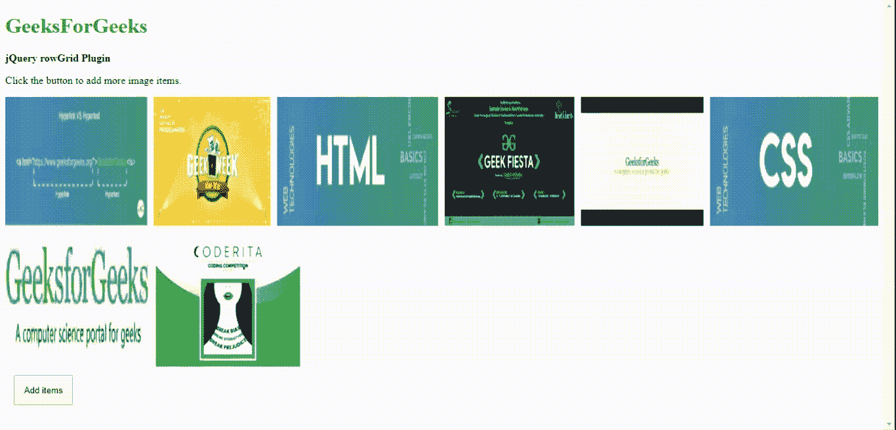

# jQuery | RowGrid 外挂程式

> 哎哎哎:# t0]https://www . geeksforgeeks . org/jquery-row grid 插件/

jQuery 提供了一个非常简单、用户友好且响应迅速的 **rowGrid** 插件，可以帮助程序员以直线方式显示图像。它重量非常轻，支持无限滚动功能。rowGrid 的真实例子是以直线网格出现的 Google+图像或 Google 图像搜索。

请[下载**的**插件。如下例所示，在工作文件夹中包含所需的文件。](https://github.com/brunjo/rowGrid.js/)

**注意:**所有图像项目应具有相同的高度，但宽度大小可以不同。所有行都与父容器的宽度匹配。如果一行不够，它会自动将项目缩小到下一行。

**示例 1:** 在下面的示例中，图像项列表是在 HTML 容器中拍摄的。所有图像的高度都相同，但宽度大小不同。**行网格()**方法以直线网格显示所有图像项目，如输出图像所示。

```
<!DOCTYPE html>
<html lang="en">

<head>
    <meta charset="UTF-8">
    <!doctype html>
    <html lang="en">

    <head>
        <meta charset="UTF-8">
        <meta name="viewport"
              content="width=device-width, initial-scale=1">
        <title>jQuery rowGrid Plugin</title>

        <script src=
"http://cdnjs.cloudflare.com/ajax/libs/jquery/2.0.3/jquery.min.js">
      </script>
        <script src="jquery.row-grid.js"></script>

        <style>
            body {
                text-align: center;
                overflow-y: scroll;
            }

            .height {
                height: 10px;
            }

            .container:after {
                // float not allowed on both sides
                clear: both;
            }

            .container:before,
            .container:after {
                content: "";
                // element behave like a table
                display: table;
            }

            .item img {
                max-height: 100%;
                max-width: 100%;
                border: 1px solid black;
                border-radius: 25px;
            }

            .first-item {
                clear: both;
            }

            .item {
                margin-bottom: 15px;
                float: left;
            }

            .first-item {
                clear: both;
            }

            .last-row,
            .last-row ~ .item {
                // remove bottom margin on last row
                margin-bottom: 0;
            }
        </style>

        <script>
            $(document).ready(function() {

                $(".container").rowGrid({
                    minMargin: 15,
                    maxMargin: 30,
                    itemSelector: ".item"

                });
            });
        </script>
    </head>

    <body>
        <h1 style="color:green">GeeksforGeeks</h1>
        <b> jQuery rowGrid plugin</b>
        <div class="height"> </div>
        <br>

        <div class="container">
            <div class="item">
                
            </div>
            <div class="item">
                
            </div>
            <div class="item">
                
            </div>
            <div class="item">
                
            </div>
            <div class="item">
                
            </div>
            <div class="item">
                
            </div>
            <div class="item">
                
            </div>
            <div class="item">
                
            </div>
            <div class="item">
                
            </div>
            <div class="item">
                
            </div>
            <div class="item">
                
            </div>
            <div class="item">
                
            </div>
        </div>
    </body>

</html>
```

**输出:**


**示例 2:** 在以下示例中，提供了一个按钮，用于在容器布局中从图像路径动态添加更多图像项，以直线显示。**行网格**插件用于在添加项目时实现垂直滚动。程序员可以根据应用调整图片 URL 链接。

```
<!DOCTYPE html>
<html lang="en">

<head>
    <meta charset="UTF-8">
    <title>jQuery rowGrid Plugin</title>
    <style>
        body {
            text-align: center;
            overflow-y: scroll;
        }

        .container:after {
            clear: both;
        }

        .container:before,
        .container:after {
            display: table;
            content: "";
        }

        .item.invisible {
            display: none;
        }

        .item {
            float: left;
            margin-bottom: 16px;
        }

        .item img {
            max-width: 100%;
            vertical-align: bottom;
            max-height: 100%;
        }

        @media (max-width: 500px) {
            .item {
                float: none;
                margin-right: auto;
                margin-left: auto;
            }
        }

        .first-item {
            clear: both;
        }

        .last-row,
        .last-row~.item {
            margin-bottom: 0;
        }

        .btnClass {
            padding: 1em;
            margin: 1em;
        }
    </style>
    <script src="jquery.row-grid.js"></script>
    <script>
        var imagecounter = 1;
        var container;

        document.addEventListener(
          'DOMContentLoaded', function() {
            container = document.getElementById('container');

            var addItemsBtnVar =
                document.querySelector('#addItemsID');

            addItemsBtnVar.addEventListener(
              "click", function() {
                addItems();
            });

            // Function call to add image items
            addItems();

            /* Start jQueryrowGrid.js plugin and its options */
            rowGrid(container, {
                itemSelector: '.item:not(.invisible)',
                minMargin: 15,
                maxMargin: 35,
                // The class of first image item of each row
                firstItemClass: 'first-item',
                // The class of first image item in the last row
                lastRowClass: 'last-row',
                minWidth: 500,
                // Resizing is done for responsive webpages
                resize: true
            });
        });

        /* Function to add sample images from the items array  */
        function addItems() {
            for (var i = 0; i < items.length; i++) {
                var item = items[i];
                var itemElement = document.createElement('div');

                itemElement.className += item.itemClass;

                var imgElement = document.createElement('img');

                //In the following, please add your own image files path     
                imgElement.src = "images-path/" + imagecounter + ".jpg";
                imgElement.setAttribute('width', item.width);
                imgElement.setAttribute('height', item.height);

                itemElement.insertAdjacentElement('afterbegin', imgElement);
                container.insertAdjacentElement('beforeend', itemElement);

                imagecounter++;
            }
        };

        const items = [{
                width: 220,
                height: 200,
                itemClass: "item"
            }, {
                width: 180,
                height: 200,
                itemClass: "item"
            }, {
                width: 250,
                height: 200,
                itemClass: "item"
            }, {
                width: 200,
                height: 200,
                itemClass: "item"
            }, {
                width: 190,
                height: 200,
                itemClass: "item"
            }, {
                width: 260,
                height: 200,
                itemClass: "item"
            }, {
                width: 220,
                height: 200,
                itemClass: "item"
            }, {
                width: 220,
                height: 200,
                itemClass: "item"
            },
        ];
    </script>
</head>

<body>
    <h1 style="color:green"> GeeksForGeeks </h1>
    <b>jQuery rowGrid Plugin</b>
    <p>Click the button to add more image items.</p>

    <div id="container" class="container">
    </div>
    <button class=".btnClass" id="addItemsID">Add items</button>
</body>

</html>
```

**输出:**
