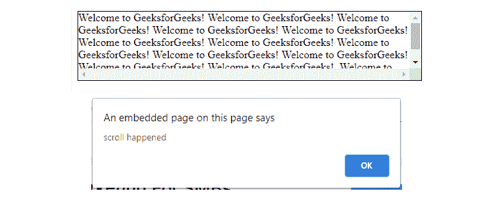

# jQuery |滚动()带示例

> 原文:[https://www.geeksforgeeks.org/jquery-scroll-with-examples/](https://www.geeksforgeeks.org/jquery-scroll-with-examples/)

scroll()是 jQuery 中的一个内置方法，用于用户在指定的元素中滚动。此方法适用于所有可滚动元素和浏览器窗口。

**语法:**

```
$(selector).scroll(function)
```

**参数:**该方法接受单参数*功能*，可选。它用于指定触发滚动事件时要运行的功能。
**返回值:**当指定元素发生滚动时，绑定一个事件。

下面的程序说明了 jQuery 中的 scroll()方法:

**示例:**

```
<!DOCTYPE html>
<html>
    <head>
        <title>scroll method</title>
        <script src=
        "https://ajax.googleapis.com/ajax/libs/jquery/3.3.1/jquery.min.js">
        </script>

        <!-- jQuery code to show the working of this method -->
        <script>
            $(document).ready(function() {
                $("div").scroll(function() {
                    alert("scroll happened");
                });
            });
        </script>
        <style>
            div {
                border: 1px solid black;
                width: 500px;
                height: 100px;
                overflow: scroll;
            }
        </style>
    </head>
    <body>

        <!-- scroll inside this div box -->
        <div>Welcome to GeeksforGeeks!
             Welcome to GeeksforGeeks!
             Welcome to GeeksforGeeks!
             Welcome to GeeksforGeeks!
             Welcome to GeeksforGeeks!
             Welcome to GeeksforGeeks!
             Welcome to GeeksforGeeks!
             Welcome to GeeksforGeeks!
             Welcome to GeeksforGeeks!
             Welcome to GeeksforGeeks!
             Welcome to GeeksforGeeks!
             Welcome to GeeksforGeeks!.
             Welcome to GeeksforGeeks!
        </div>
    </body>
</html>
```

**输出:**
在 div 框内滚动后。
