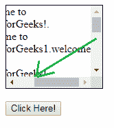
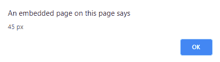
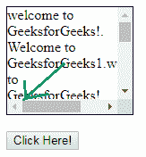
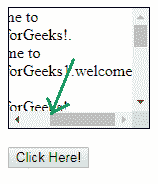

# jQuery | scrolleft()带示例

> 原文:[https://www . geesforgeks . org/jquery-scrolleft-with-examples/](https://www.geeksforgeeks.org/jquery-scrollleft-with-examples/)

scrollLeft()方法是 jQuery 中的一个内置方法，用于返回或设置滚动条的水平位置。

**语法:**

```html
$(selector).scrollLeft(position)
```

**参数:**该方法接受单参数*位置*，可选。它用于以像素为单位指定水平滚动条的位置。

**返回值:**这个方法返回滚动条的位置。

下面的例子说明了 jQuery 中的 scrollLeft()方法。

**例 1:**

```html
<!DOCTYPE html>
<html>
    <head>
        <title>scrollLeft method</title>
        <script src=
        "https://ajax.googleapis.com/ajax/libs/jquery/3.3.1/jquery.min.js">
        </script>

        <!-- jQuery code to show the working of this method -->
        <script>
            $(document).ready(function() {
                $("button").click(function() {
                    alert($("div").scrollLeft() + " px");
                });
            });
        </script>
        <style>
            div {
                border: 1px solid black;
                width: 140px;
                height: 120px;
                overflow: auto
            }
        </style>
    </head>
    <body>
        <div>
            welcome to GeeksforGeeks!. Welcome to GeeksforGeeks1.welcome
            to GeeksforGeeks!. Welcome to GeeksforGeeks1\. Welcome to 
            GeeksforGeeks!. Welcome to GeeksforGeeks!.welcome to 
            GeeksforGeeks!. Welcome to GeeksforGeeks1\. Welcome to GeeksforGeeks!.
        </div>
        <br>
        <!-- click on this button to get the position of the scrollbar -->
        <button>Click Here!</button>

    </body>

</html>
```

**输出:**
之前点击按钮:

返回箭头所示位置:


**例 2:**

```html
<!DOCTYPE html>
<html>
    <head>
        <title>scrollLeft method</title>
        <script src=
        "https://ajax.googleapis.com/ajax/libs/jquery/3.3.1/jquery.min.js">
        </script>

        <!-- jQuery code to show the working of this method -->
        <script>
            $(document).ready(function() {
                $("button").click(function() {
                    $("div").scrollLeft(100);
                });
            });
        </script>
        <style>
            div {
                border: 1px solid black;
                width: 140px;
                height: 120px;
                overflow: auto
            }
        </style>
    </head>
    <body>
        <div style="">
            welcome to GeeksforGeeks!. Welcome to GeeksforGeeks1.welcome
            to GeeksforGeeks!. Welcome to GeeksforGeeks1\. Welcome to
            GeeksforGeeks!. Welcome to GeeksforGeeks!.welcome to 
            GeeksforGeeks!. Welcome to GeeksforGeeks1\. Welcome to
            GeeksforGeeks!.
        </div>
        <br>

        <!-- click on this button to get the position
        of the scrollbar -->
        <button>Click Here!</button>
    </body>
</html>
```

**输出:**
之前点击箭头所示的按钮位置。


点击箭头所示的按钮位置后。
