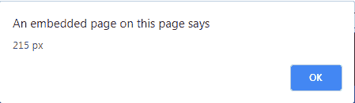

# jQuery | scrollTop()

> 原文:[https://www . geeksforgeeks . org/jquery-scroll top-with-examples/](https://www.geeksforgeeks.org/jquery-scrolltop-with-examples/)

scrollTop()方法是 jQuery 中的一个内置方法，用于返回滚动条的垂直顶部位置。

**语法:**

```html
$(selector).scrollTop(position)
```

**参数:**该方法接受单参数*位置*，可选。它用于以像素为单位指定垂直滚动条的位置。

**返回值:**该方法返回滚动条的顶部位置。

下面的例子说明了 jQuery 中的 scrollTop()方法:

**示例:**

```html
<!DOCTYPE html>
<html>
    <head>
        <title>scrollTop method</title>
        <script src=
        "https://ajax.googleapis.com/ajax/libs/jquery/3.3.1/jquery.min.js">
        </script>

        <!-- jQuery code to show the working of this method -->
        <script>
            $(document).ready(function() {
                $("button").click(function() {
                    alert($("div").scrollTop() + " px");
                });
            });
        </script>
        <style>
            div {
                border: 1px solid black;
                width: 100px;
                height: 150px;
                overflow: auto;
            }
        </style>
    </head>
    <body>
        <div>
            Welcome to GeeksforGeeks!. Welcome to GeeksforGeeks!. Welcome
            to GeeksforGeeks!. Welcome to GeeksforGeeks!. Welcome to
            GeeksforGeeks!. Welcome to GeeksforGeeks!. Welcome to
            GeeksforGeeks!. Welcome to GeeksforGeeks!. Welcome to 
            GeeksforGeeks!. Welcome to GeeksforGeeks!. Welcome to 
            GeeksforGeeks!. Welcome to GeeksforGeeks!. Welcome to 
            GeeksforGeeks!. Welcome to GeeksforGeeks!. Welcome to 
            GeeksforGeeks!. Welcome to GeeksforGeeks!</div>
        <br>

        <!-- move the scroll bar and click on this button -->
        <button>Click Here !</button>
    </body>
</html>
```

**输出:**
之前点击按钮:

上图所示顶部位置的像素值:
