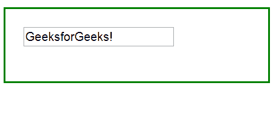
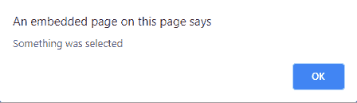

# jQuery |选择()并举例

> 原文:[https://www.geeksforgeeks.org/jquery-select-with-examples/](https://www.geeksforgeeks.org/jquery-select-with-examples/)

select()方法是 jQuery 中的一个内置方法，当在文本区域或文本字段中选择(或标记)一些字母或单词时使用。

**语法:**

```html
$(selector).select(function);
```

**参数:**该方法接受单参数*功能*，可选。此函数参数将在选择方法调用后运行。

**返回值:**该方法在选择某个内容时返回通知。

下面的例子说明了 jQuery 中的 select()方法:

**示例:**

```html
<!DOCTYPE html>
<html>
    <head>
        <title>Select Method</title>
        <script src=
        "https://ajax.googleapis.com/ajax/libs/jquery/3.3.1/jquery.min.js">
        </script>

        <!-- JQuery code to show the working of this method -->
        <script>
            $(document).ready(function() {
                $("input").select(function() {
                    alert("Something was selected");
                });
            });
        </script>
        <style>
            div {
                width: 250px;
                height: 40px;
                padding: 20px;
                border: 2px solid green;
            }
        </style>
    </head>
    <body>
        <div>
            <!-- select any thing from inside this field -->
            <input type="text" value="GeeksforGeeks!">
        </div>
    </body>
</html>
```

**输出:**
在选择任何东西之前！

选择一些字母或单词后！
