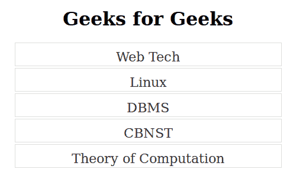
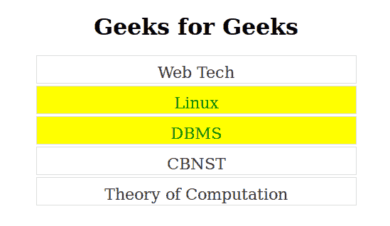
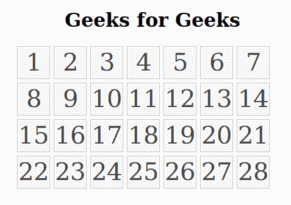
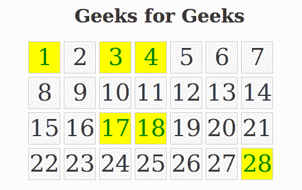
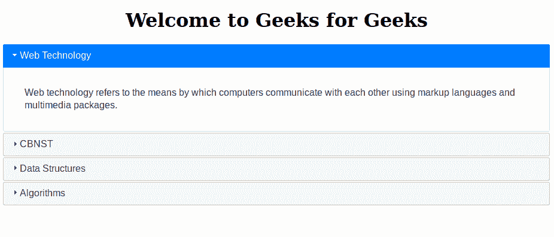
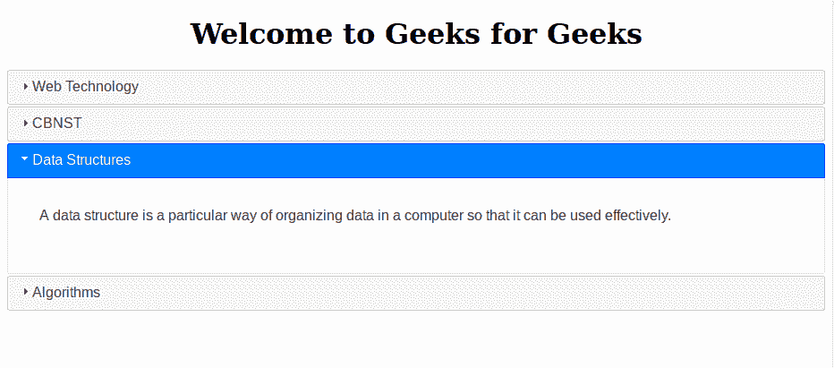
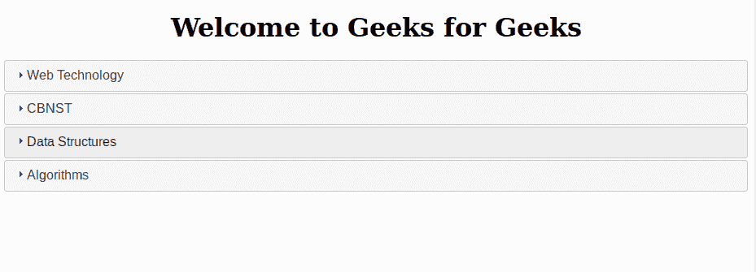

# jQuery |可选()和手风琴()

> 原文:[https://www . geesforgeks . org/jquery-selected-and-accordion/](https://www.geeksforgeeks.org/jquery-selectable-and-accordion/)

**jQuery UI** 用于将强大的效果融入到网站或网页中。
在本文中，将讨论关于 jQuery UI 交互和小部件的内容，例如可选和折叠，允许以逻辑方式选择和显示项目。

1.  **Selectable() Method**
    This method allows the elements to be selected with the help of mouse. Using jQuery UI, we can select the DOM(**D**ocument **O**bject **M**odel) elements which is available to select. This can be done by clicking on the selectable object by mouse and performing other work.
    **Syntax:**
    The selectable() method has two forms and the use of each form depends on the requirement. These are as follows :-

    ```
    $(selector, context).selectable (options);
    ```

    ```
    $(selector, context).selectable ("action", [params]);
    ```

    **给定的表格显示了可选()方法可以使用的不同选项:**

    | [计]选项 | 目的 |
    | --- | --- |
    | 自动刷新 | 如果该选项的值设置为“真”，它将允许在选择
    操作开始时计算每个选定元素的位置和大小。该选项的默认值设置为“真”。 |
    | 取消 | 该选项用于禁止选择 DOM 元素(可选元素)。如果该选项的值被设置为 **li** ，那么它将阻止网页中所有列表项的
    选择。这个选项的默认值是文本区，输入，按钮，选项，选择。这意味着默认情况下，这些
    元素不能在网页中选择。 |
    | 耽搁 | 该选项用于在用户点击和开始选择项目之间产生延迟。该选项的主要目的是避免
    不需要的选择。此选项的默认值为 0。 |
    | 过滤器 | 此选项用于指示元素中用于选择项目的部分。该选项的默认值为*表示可以通过单击项目上的任意位置来选择该项目。 | 有缺陷的 | 此选项用于禁用选择过程。当该选项的值设置为 true 时，将禁用选择过程。要启用
    选择过程，使用启用选项。此选项的默认值为 false。 |

    **示例:**

    *   **Default Functionality –**
        **Code :**

        ```
        <!doctype html>
        <html lang="en">
        <head>
        <title>jQuery UI Selectable() Method - Default functionality</title>
        <link rel="stylesheet" 
        href="//code.jquery.com/ui/1.12.1/themes/base/jquery-ui.css">
        <link rel="stylesheet" href="/resources/demos/style.css">
        <style type="text/css">
        #select .ui-selecting {
                            background: aqua;
                            }
        #select .ui-selected { 
                            background: yellow; 
                            color: green; 
                            }
        #select { 
                list-style-type: none; 
                margin: 0; 
                padding: 0; 
                width: 50%; 
                }
        #select li { 
                margin: 3px; 
                padding: 10px; 
                font-size: 1.4em; 
                height: 18px; 
                }
        </style>
        <script src="https://code.jquery.com/jquery-1.12.4.js"></script>
        <script src="https://code.jquery.com/ui/1.12.1/jquery-ui.js"></script>
        <script>
        $( function() {
            $( "#select" ).selectable();
        });
        </script>
        </head>
        <body>
        <h1 align="center">Geeks for Geeks</h1>
        <center>
        <ol id="select">
        <li class="ui-widget-content">Web Tech</li>
        <li class="ui-widget-content">Linux</li>
        <li class="ui-widget-content">DBMS</li>
        <li class="ui-widget-content">CBNST</li>
        <li class="ui-widget-content">Theory of Computation</li>
        </ol>
        </center>
        </body>
        </html>                    
        ```

        **输出:**
        选择前:
        
        选择后: **Linux 和 DBMS 部分**部分:
        
        **注意:**使用 Ctrl +单击选择多个选项。

    *   **Grid Display –**
        **Code :**

        ```
        <!doctype html>
        <html lang="en">
        <head>
        <title>jQuery UI Selectable() Method - Display as grid</title>
        <link rel="stylesheet" 
        href="//code.jquery.com/ui/1.12.1/themes/base/jquery-ui.css">
        <link rel="stylesheet" href="/resources/demos/style.css">
        <style type="text/css">
        #grid .ui-selecting { 
                            background: aqua;
                            }
        #grid .ui-selected { 
                        background: yellow; 
                        color: green; 
                        }
        #grid { 
            list-style-type: none; 
            margin: 0; 
            padding: 0; 
            width: 450px; 
            }
        #grid li { 
                margin: 3px; 
                padding: 1px; 
                float: left; 
                width: 50px; 
                height: 50px; 
                font-size: 2.5em; 
                text-align: center; 
                }
        </style>
        <script src="https://code.jquery.com/jquery-1.12.4.js">
        </script>
        <script src="https://code.jquery.com/ui/1.12.1/jquery-ui.js">
        </script>
        <script>
        $( function() {
            $( "#grid" ).selectable();
        });
        </script>
        </head>
        <body>
        <center>
        <h1>Geeks for Geeks</h1>
        <ol id="grid">
        <li class="ui-state-default">1</li>
        <li class="ui-state-default">2</li>
        <li class="ui-state-default">3</li>
        <li class="ui-state-default">4</li>
        <li class="ui-state-default">5</li>
        <li class="ui-state-default">6</li>
        <li class="ui-state-default">7</li>
        <li class="ui-state-default">8</li>
        <li class="ui-state-default">9</li>
        <li class="ui-state-default">10</li>
        <li class="ui-state-default">11</li>
        <li class="ui-state-default">12</li>
        <li class="ui-state-default">13</li>
        <li class="ui-state-default">14</li>
        <li class="ui-state-default">15</li>
        <li class="ui-state-default">16</li>
        <li class="ui-state-default">17</li>
        <li class="ui-state-default">18</li>
        <li class="ui-state-default">19</li>
        <li class="ui-state-default">20</li>
        <li class="ui-state-default">21</li>
        <li class="ui-state-default">22</li>
        <li class="ui-state-default">23</li>
        <li class="ui-state-default">24</li>
        <li class="ui-state-default">25</li>
        <li class="ui-state-default">26</li>
        <li class="ui-state-default">27</li>
        <li class="ui-state-default">28</li>
        </ol> 
        </center> 
        </body>
        </html>                    
        ```

        **输出:**
        选择前:
        
        从网格中选择所需数字后:
        

2.  **Accordion() Method:**
    The accordion is a widget which is provided by jQuery UI. The main purpose of accordion is to break the page content into logical section.Each section consist of two parts –
    1.  **表头**本部分包含章节标题。标题部分通常是使用标题标签创建的。
    2.  **正文**这部分包含了小节的内容。正文部分通常使用 div 标签创建。

    网页中的手风琴可以使用 jQuery 库提供的手风琴()方法创建。
    **语法:**
    使用手风琴法的语法如下

    ```
    $(selector).accordion (options)
    ```

    ```
    $(selector).accordion ("action", params)
    ```

    **给定的表格显示了手风琴()方法可以使用的不同选项:**

    | 选择权 | 目的 |
    | --- | --- |
    | 活跃的 | 此选项只能接受布尔值和整数值。当该选项设置为 false 时，它将允许面板折叠。此选项的默认值为真。 |
    | 有生命的 | 该选项可以采用整数值、布尔值或字符串值。此选项用于在打开面板时制作动画。如果该选项的值设置为 false，它将禁用动画。 |
    | 有缺陷的 | 此选项用于禁用手风琴。当此选项的值设置为 true 时，它将禁用折叠。要启用折叠过程，禁用选项设置为 false。此选项的默认值为 false。 |

    **示例:**

    *   **Default Functionality –**In default functionality, the one section of the accordion is always open.
        **Code :**

        ```
        <!doctype html>
        <html lang="en">
        <head>
        <title>Accordion Effect - Default functionality</title>
        <link rel="stylesheet" 
        href="//code.jquery.com/ui/1.12.1/themes/base/jquery-ui.css">
        <script src="https://code.jquery.com/jquery-1.12.4.js">
        </script>
        <script src="https://code.jquery.com/ui/1.12.1/jquery-ui.js">
        </script>
        <script>
        $(function() {
            $( "#gfg" ).accordion();
        });
        </script>
        </head>
        <body>
        <h1 align="center">Welcome to Geeks for Geeks</h1>
        <div id="gfg">
        <h3>Web Technology</h3>
        <div>
        <p>
            Web technology refers to the means by which computers 
            communicate with each other using markup languages and
            multimedia packages.
        </p>
        </div>
        <h3>CBNST</h3>
        <div>
        <p>
        Computer Based Numerical and Statistical Techniques: CBNST is
        use to optimize performance and minimize error in problem-solving
        application. Application of Computer Based Numerical and
        Statistical Techniques:
        </p>
        </div>
        <h3>Data Structures</h3>
        <div>
        <p>
        A data structure is a particular way of organizing data in a computer
         so that it can be used effectively. 
        </p>
        </div>
        <h3>Algorithms</h3>
        <div>
        <p>
        An algorithm is an unambiguous specification of how to solve a
        class of problems. Algorithms can perform calculation, data processing
        and automated reasoning tasks.

        </p>
        </div>
        </div>
        </body>
        </html>                    
        ```

        **输出:**
        在点击任何部分
        之前
        在点击**数据结构**部分
        之后

    *   **Collapsible Content –**To remove the default functionality, the collapsible option is set to true.
        **Code :**

        ```
        <!doctype html>
        <html lang="en">
        <head>
        <title>jQuery UI Accordion - Collapsible Content</title>
        <link rel="stylesheet" 
        href="//code.jquery.com/ui/1.12.1/themes/base/jquery-ui.css">
        <script src="https://code.jquery.com/jquery-1.12.4.js">
        </script>
        <script src="https://code.jquery.com/ui/1.12.1/jquery-ui.js">
        </script>
        <script>
        $(function() {
            $( "#gfg" ).accordion({ collapsible: true});
        });
        </script>
        </head>
        <body>
        <h1 align="center">Welcome to Geeks for Geeks</h1>
        <div id="gfg">
        <h3>Web Technology</h3>
        <div>
        <p>
         Web technology refers to the means by which computers 
         communicate with each other using markup languages and 
         multimedia packages.
        </p>
        </div>
        <h3>CBNST</h3>
        <div>
        <p>
        Computer Based Numerical and Statistical Techniques: 
        CBNST is use to optimize performance and minimize error
        in problem-solving application.
        </p>
        </div>
        <h3>Data Structures</h3>
        <div>
        <p>
        A data structure is a particular way of organizing data in a computer
         so that it can be used effectively. 
        </p>
        </div>
        <h3>Algorithms</h3>
        <div>
        <p>
        An algorithm is an unambiguous specification of how to solve a class
        of problems. Algorithms can perform calculation, data processing and
        automated reasoning tasks.
        </p>
        </div>
        </div>
        </body>
        </html>                    
        ```

        **输出:**
        点击**数据结构**选项一次后
        
        点击**数据结构**选项两次后
        