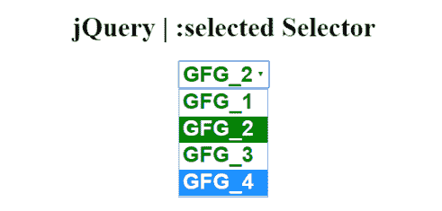
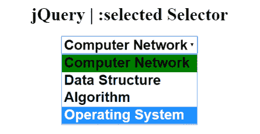

# jQuery |:选中选择器

> 原文:[https://www.geeksforgeeks.org/jquery-selected-selector/](https://www.geeksforgeeks.org/jquery-selected-selector/)

**:选择选择器**用于选择预先选择的选项元素。

**注意:**要仅检索复选框或单选按钮，请使用:选中的选择器。

**语法:**

```
$(":selected")
```

以下示例说明了 jQuery 中的**:选定选择器**:

**示例 1:** 本示例对所有预选元素使用 CSS 属性。预选元素的背景色为红色，由:选定选择器更改。

```
<!DOCTYPE html>  
<html>  

<head> 
    <title> 
        jQuery | :selected Selector
    </title>

    <script src=
"https://ajax.googleapis.com/ajax/libs/jquery/3.3.1/jquery.min.js">
    </script>

    <!-- Script to set style to the selected selector -->
    <script>
        $(document).ready(function() {
            $(":selected").css("background-color", "green");
            $(":selected").css("color", "white");
        });
    </script>

    <!-- CSS property to set Style to the element -->
    <style>
        option {
            font-weight: bold;
            font-size: 25px;
            color: green;
        }
        select {
            font-weight: bold;
            font-size: 25px;
            color: green;
        }
    </style>
</head> 

<body style = "text-align:center;">  
    <h1>  
        jQuery | :selected Selector
    </h1>  

    <select>
        <option>GFG_1</option>
        <option selected="selected">GFG_2</option>
        <option>GFG_3</option>
        <option>GFG_4</option>
    </select>
</body>  

</html>   
```

**输出:**


**例 2:** 这个例子和前一个类似。

```
<!DOCTYPE html>  
<html>  

<head> 
    <title> 
        jQuery | :selected Selector
    </title>

    <script src=
"https://ajax.googleapis.com/ajax/libs/jquery/3.3.1/jquery.min.js">
    </script>

    <!-- Script to set background-color of
        selected element -->
    <script>
        $(document).ready(function() {
            $(":selected").css("background-color", "green");
        });
    </script>

    <style>
        option {
            font-weight: bold;
            font-size: 25px;
        }
        select {
            font-weight: bold;
            font-size: 25px;
        }
    </style>
</head> 

<body style="text-align:center;">  
    <h1>  
        jQuery | :selected Selector
    </h1>  

    <select>
        <option selected="selected">Computer Network</option>
        <option>Data Structure</option>
        <option>Algorithm</option>
        <option>Operating System</option>
    </select>
</body>  

</html>     
```

**输出:**
