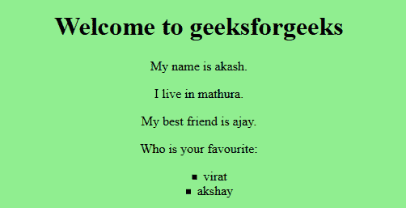
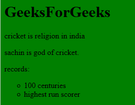

# jQuery | *选择器

> 原文:[https://www.geeksforgeeks.org/jquery-selector/](https://www.geeksforgeeks.org/jquery-selector/)

jQuery ***选择器**选择文档中的所有元素，包括 HTML、正文和标题。如果*选择器与另一个元素一起使用，则它会选择所用元素中的所有子元素。
**语法**

```
$("*")
```

**示例-1:** 选择所有元素并更改背景颜色。

## 超文本标记语言

```
<!DOCTYPE html>
<html>

<head>
    <script src=
"https://ajax.googleapis.com/ajax/libs/jquery/3.3.1/jquery.min.js">
  </script>

  <script>
    $(document).ready(function() {
      $("*").css("background-color",
                  "lightgreen");
        });
    </script>
</head>

<body>

    <center>
        <h1>Welcome to geeksforgeeks
      </h1>

<p>My name is akash.</p>

<p>I live in mathura.</p>

<p>My best friend is ajay.
      </p>

<p>Who is your favourite:
      </p>

        <ul type="square">
            <li>virat</li>
            <li>akshay</li>
        </ul>
    </center>

</body>

</html>
```

**输出:**



**示例-2:** 选择所有元素并更改背景颜色。

## 超文本标记语言

```
<!DOCTYPE html>
<html>

<head>
    <script src=
"https://ajax.googleapis.com/ajax/libs/jquery/3.3.1/jquery.min.js">
  </script>

  <script>
   $(document).ready(function() {
    $("*").css("background-color",
               "green");
        });
    </script>
</head>

<body>
    <h1>GeeksForGeeks</h1>

<p>cricket is religion in india
  </p>

<p>sachin is god of cricket.
  </p>

<p>records:</p>

    <ul type="circle">
        <li>100 centuries</li>
        <li>highest run scorer</li>
    </ul>

</body>

</html>
```

**输出:**



**支持的浏览器:**

*   Internet Explorer 9.0
*   Firefox 3.6
*   Safari 4.0
*   歌剧 10.5