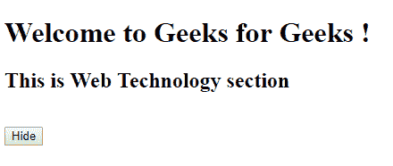
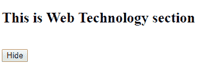
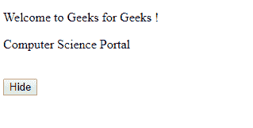
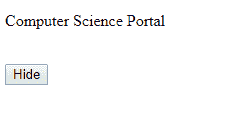
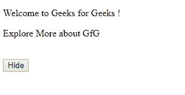
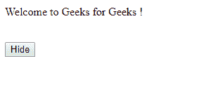

# jQuery |选择器和事件方法

> 原文:[https://www . geesforgeks . org/jquery-选择器和事件-方法/](https://www.geeksforgeeks.org/jquery-selectors-and-event-methods/)

[jQuery](https://www.geeksforgeeks.org/jquery-introduction/) 是一个功能强大的 JavaScript 库。它比 JavaScript 更强大。jQuery 的代码比标准的 JavaScript 代码更精确、更短、更简单。它可以执行多种功能。
在本文中，我们将学习 jQuery 选择器、jQuery Event 方法和一些有用的方法。

<center>**jQuery selectors:**</center>

```
 $("selector-name")
```

*   **Elements Selector :**
    The elements selector selects the element on the basis of its name.
    **Example :**
    In this example, when the user clicks on button, the **<h1>** element gets hidden.
    Code :-

    ```
    <!DOCTYPE html>
    <html>

    <head>
        <script src="https://ajax.googleapis.com/ajax/libs/jquery/3.3.1/jquery.min.js">
    </script>
    </head>

    <body>
        <h1>Welcome to Geeks for Geeks !</h1>
        <h2>This is Web Technology section </h2>
        <br/>
        <button>Hide</button>
        <script type="text/javascript">
            $("button").click(function() {
                $("h1").hide();
            });
        </script>
    </body>

    </html>
    ```

    **输出:**
    点击**前隐藏**按钮:
    
    点击**后隐藏**按钮:
    

*   **Id 选择器:**
    Id 选择器根据元素的 Id 选择元素。
    **示例:**
    在本例中，当用户双击按钮时，带有 **id = "gfg"** 的元素被隐藏。
    代码:-

```
<!DOCTYPE html>
<html>

<head>
    <script src="https://ajax.googleapis.com/ajax/libs/jquery/3.3.1/jquery.min.js">
</script>
</head>

<body>
    <p id="gfg">Welcome to Geeks for Geeks !</p>
    <p id="GFG">Computer Science Portal </p>
    <br/>
    <button>Hide</button>
    <script type="text/javascript">
        $("button").dblclick(function() {
            $("#gfg").hide();
        });
    </script>
</body>

</html>
```

**输出:**
双击**前隐藏**按钮:

双击**后隐藏**按钮:


*   **Class Selector :**
    The class selector selects the element on the basis of its class.
    **Example :**
    In this example, when the user clicks on button, the element with **class = “GFG”** gets hidden.
    Code :-

    ```
    <!DOCTYPE html>
    <html>

    <head>
        <script src="https://ajax.googleapis.com/ajax/libs/jquery/3.3.1/jquery.min.js">
    </script>
    </head>

    <body>
        <p class="gfg">Welcome to Geeks for Geeks !</p>
        <p class="GFG">Explore More about GfG </p>
        <br/>
        <button>Hide</button>
        <script type="text/javascript">
            $("button").click(function() {
                $(".GFG").hide();
            });
        </script>
    </body>

    </html>
    ```

    **输出:**
    点击**前隐藏**按钮:
    
    点击**后隐藏**按钮:
    

<center>**jQuery Event methods:**</center>

Event refers to the actions performed by the site visitor during their interactivity with the website (or webpage).There can be various types of events such as

1.  用户点击按钮。
2.  用户在图像上移动鼠标指针。
3.  用户按下键盘上的任何键等。

给出了一些事件方法

| 方法名 | 描述 |
| 点击() | click()方法包含一个用于事件处理的函数，当用户单击特定的 HTML 元素时会调用该函数。 |
| dblclick() | dblclick()方法包含一个用于事件处理的函数，当用户双击特定的 HTML 元素时调用该函数。 |
| 滑鼠 enter() | mouseenter()方法包含一个用于事件处理的函数，当鼠标指针进入特定的 HTML 元素时调用该函数。 |
| mouseleave() | mouseleave()方法包含一个用于事件处理的函数，当鼠标指针从先前选择的特定 HTML 元素中移除时，该函数将被调用。 |
| 鼠标按下() | mousedown()方法包含一个用于事件处理的函数，当鼠标指针在 HTML 元素上按下鼠标左键、右键或中键时调用该函数。 |
| 鼠标松开() | mouseup()方法包含一个用于事件处理的函数，当鼠标指针在 HTML 元素上时，释放鼠标左键、右键或中键时会调用该函数。 | 悬停() | hover()方法包含一个用于事件处理的函数，当鼠标指针进入和离开 HTML 元素时调用该函数。它是 mouseenter()和 mouseleave()方法的组合。 |

<center>**Get and Set Methods:**</center>

jQuery has various methods to get the value of an attribute and set the attribute to specific value.There methods are powerful enough to the change the website content and its style. Some of them are:

1.  **text()–**该方法用于获取或设置所选 HTML 元素的文本内容。
2.  **html()–**该方法用于获取或设置选中元素(包括 HTML 元素)的内容。
3.  **val()–**该方法用于获取或设置网页中各种表单域的值。
4.  **attr()–**该方法用于获取或设置网页中各种属性的值。
5.  **css()–**该方法用于获取或设置网页中各种 CSS 属性的值。

    **Example :**

    ```
    <!DOCTYPE html>
    <html>

    <head>
        <script src="https://ajax.googleapis.com/ajax/libs/jquery/3.3.1/jquery.min.js">
    </script>
        <style type="text/css">
            #e5 {
                width: 100px;
                height: 100px;
                border-radius: 0px;
                background-color: aqua;
            }
        </style>
    </head>

    <body>
        <p id="e1">Welcome.</p>
        <p id="e2">Learn and Explore</p>
        <p>
            <input type="text" id="e3" value="jQuery is powerful!" />
        </p>
        <p id="e4" align="left">Geeks for Geeks</p>
        <p>
            <div id="e5"></div>
        </p>
        <button id="gfg1">Change Text</button>
        <button id="gfg2">Change HTML</button>
        <button id="gfg3">Change Value</button>
        <button id="gfg4">Change Alignment</button>
        <button id="gfg5">Change Shape</button>
        <script type="text/javascript">
            $("#gfg1").click(function() {
                $("#e1").text("Geeks for Geeks");
            });
            $("#gfg2").click(function() {
                $("#e2").html("<b>Enrich your Knowledge.</b>");
            });
            $("#gfg3").click(function() {
                $("#e3").val("jQuery at Geeks for Geeks");
            });
            $("#gfg4").click(function() {
                $("#e4").attr("align", "center");
            });
            $("#gfg5").click(function() {
                $("#e5").css("border-radius", "50px");
            });
        </script>
    </body>

    </html>
    ```

    **输出:**
    点击按钮前:
    
    点击按钮后:
    