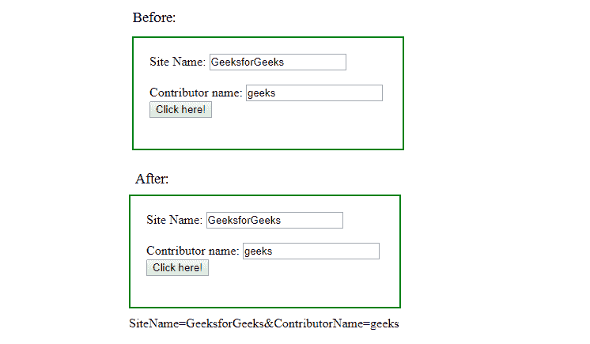

# jQuery |用示例序列化()

> 原文:[https://www . geesforgeks . org/jquery-serialize-with-examples/](https://www.geeksforgeeks.org/jquery-serialize-with-examples/)

serialize()方法是 jQuery 中的一个内置方法，用于以标准的 URL 编码符号创建文本字符串。这个方法可以作用于已经选择了单个表单控件的 jQuery 对象，例如 input、textarea 等。

**语法:**

```html
$(selector).serialize()
```

**参数:**该方法不包含任何参数。

**返回值:**该方法返回所选元素的对象字符串。

下面的示例说明了 jQuery 中的 serialize()方法:

**示例:**

```html
<!DOCTYPE html>
<html>
    <head>
        <title>serialize Method</title>
        <script src=
        "https://ajax.googleapis.com/ajax/libs/jquery/3.3.1/jquery.min.js">
        </script>

        <!-- jQuery code to show the working of this method -->
        <script>
            $(document).ready(function() {
                $("button").click(function() {
                    $("#d").text($("form").serialize());
                });
            });
        </script>
        <style>
            #d1 {
                width: 300px;
                height: 100px;
                padding: 20px;
                border: 2px solid green;
                margin-bottom: 10px;
            }
        </style>
    </head>
    <body>
        <div id="d1">
            <form action="">
                Site Name:
                <input type="text" name="SiteName" value="GeeksforGeeks">
                <br>
                <br> Contributor name:
                <input type="text" name="ContributorName" value="geeks">
                <br>
            </form>
            <!-- click on this button -->
            <button>Click here!</button>
        </div>
        <div id="d"></div>
    </body>
</html>
```

**输出:**
