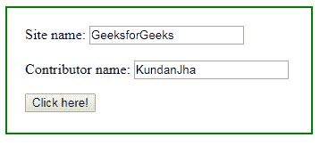
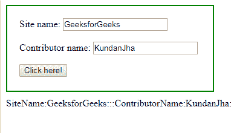

# jQuery | serializeray()带示例

> 原文:[https://www . geeksforgeeks . org/jquery-serialisearray-with-examples/](https://www.geeksforgeeks.org/jquery-serializearray-with-examples/)

**serializeArray()** 是 jQuery 中的一个内置方法，用于创建一个准备编码为 JSON 字符串的对象的 JavaScript 数组。它对表单和/或表单控件的 jQuery 集合进行操作。控件可以有几种类型。JSON 字符串是一个文本，可以将任何 JavaScript 对象转换成 JSON，并将 JSON 发送到服务器。
**语法:**

```
$(selector).serializeArray()

```

**参数:**不接受任何参数。

**返回值:**返回一串对象。

**显示 serializeArray()方法工作情况的 jQuery 代码:**

```
<html>

<head>
    <script 
    src="https://ajax.googleapis.com/ajax/libs/jquery/3.3.1/jquery.min.js">
    </script>
    <!-- jQuery code to show the working of this method -->
    <script>
        $(document).ready(function() {
            $("button").click(function() {
                var x = $("form").serializeArray();
                $.each(x, function(i, field) {
                    $("#d").append(field.name + ":" + field.value + ":::");
                });
            });
        });
    </script>
    <style>
        #d1 {
            width: 300px;
            height: 100px;
            padding: 20px;
            border: 2px solid green;
            margin-bottom: 10px;
        }
    </style>
</head>

<body>
    <div id="d1">
        <form action="">
            Site name:
            <input type="text" name="SiteName" value="GeeksforGeeks">
            <br>
            <br> Contributor name:
            <input type="text" name="ContributorName" value="KundanJha">
            <br>
        </form>
        <!-- click on this button -->
        <button>Click here!</button>
    </div>
    <div id="d"></div>

</body>

</html>
```

**输出:**
点击前“点击这里！”
按钮-

点击“点击这里！”按钮-
