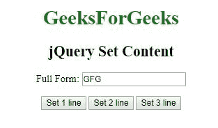
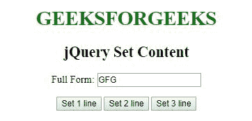
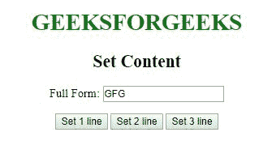
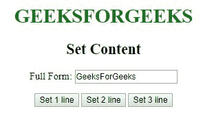
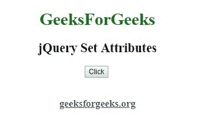
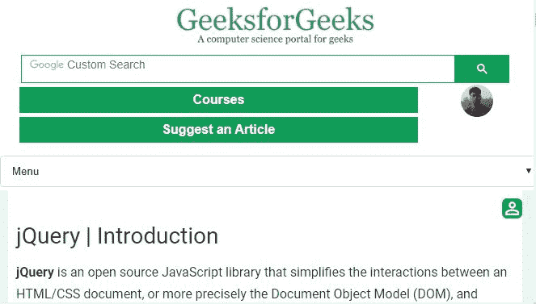

# jQuery |设置内容和属性

> 原文:[https://www . geesforgeks . org/jquery-set-content-and-attributes/](https://www.geeksforgeeks.org/jquery-set-content-and-attributes/)

**设置内容:**用于使用 jQuery 设置内容。以下方法用于设置下列内容:

*   **text():** 用于设置或返回选中元素的文本内容。
*   **html():** 用于设置或返回选中元素的 innerHTML 内容。
*   **val():** 此参数用于设置或返回所选元素的属性值。此方法适用于 HTML 表单元素。

**示例:**本示例使用 set content 方法(text()、html()和 val()方法)设置内容。

```
<!DOCTYPE html>
<html>

<head> 
    <title>jQuery Set Content</title>

    <script src=
"https://ajax.googleapis.com/ajax/libs/jquery/3.3.1/jquery.min.js">
    </script>
</head> 

<body style="text-align:center;">

    <h1 id="GFG1" style = "color:green;">
        GeeksForGeeks
    </h1>

    <h2 id="GFG2">jQuery Set Content</h2>

    <p>Full Form: <input type="text" id="GFG3" value="GFG"></p>

    <button id="btn1">Set 1 line</button>
    <button id="btn2">Set 2 line</button>
    <button id="btn3">Set 3 line</button>

    <!-- Script to set the content -->
    <script>
        $(document).ready(function() {
            $("#btn1").click(function() {
                $("#GFG1").text("GEEKSFORGEEKS");
            });

            $("#btn2").click(function() {
                $("#GFG2").html("<b>Set Content</b>");
            });

            $("#btn3").click(function() {
                $("#GFG3").val("GeeksForGeeks");
            });
        });
    </script>
</body>

</html>  
```

**输出:**

*   **之前点击按钮:**
    
*   **点击设置 1 行按钮后:**
    
*   **后点击设置 2 行按钮:**
    
*   **点击设置 3 行按钮后:**
    

**设置属性:**jQuery 中的 **jQuery attr()方法**用于设置和更改属性值。

**示例:**本示例使用 attr()方法设置和更改属性值。

```
<!DOCTYPE html>
<html>

<head> 
    <title>jQuery Set Attributes</title>

    <script src=
"https://ajax.googleapis.com/ajax/libs/jquery/3.3.1/jquery.min.js">
    </script>
</head> 

<body style="text-align:center;">

    <h1 style="color:green;">
        GeeksForGeeks
    </h1>

    <h2>jQuery Set Attributes</h2>

    <button id="btn1">Click</button>

    <br><br>

    <h3>
        <a href="https://geeksforgeeks.org" id="GFG">
            geeksforgeeks.org
        </a>
    </h3>

    <!-- Script to use set attribute method -->
    <script>
        $(document).ready(function() {
            $("button").click(function() {
                $("#GFG").attr("href", 
"https://www.geeksforgeeks.org/jquery-introduction/");
            });
        });
    </script>
</body>

</html>  
```

**输出:**

*   **之前点击链接:**
    
*   **点击链接后再点击按钮:**
    
*   **点击链接后点击按钮:**
    