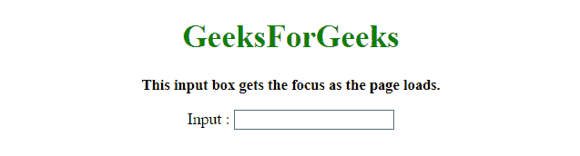

# JQuery |在页面加载时将焦点设置在表单输入文本字段上

> 原文:[https://www . geesforgeks . org/jquery-set-focus-on-a-form-input-text-field-on-page-load/](https://www.geeksforgeeks.org/jquery-set-focus-on-a-form-input-text-field-on-page-load/)

任务是使用 JQuery 设置表单输入文本字段的焦点。为此，这里讨论了一些最常用的技术。
首先需要讨论 focus()方法。

*   **jQuery focus()方法:**
    当一个元素获得焦点时，焦点事件发生(通过鼠标点击或“定位”选择)。
    该方法触发焦点事件，或者在焦点事件发生时增加一个函数运行。
    **语法:**
    *   **触发所选元素的焦点事件:**

        ```html
        $(selector).focus()

        ```

    *   **给焦点事件附加一个功能:**

```html
$(selector).focus(function)

```

**参数:**

*   **功能:**该参数为可选。它指定焦点事件发生时要执行的函数。

**示例 1:** 在本示例中，表单输入文本字段通过使用**焦点()方法**在页面加载时获取**焦点**。这里的输入元素是通过 JQuery 选择器中的输入关键字选择的。

```html
<!DOCTYPE HTML>
<html>

<head>
    <title>
        JQuery 
      | Set focus on a form input text field on page load.
    </title>
    <script src=
"https://ajax.googleapis.com/ajax/libs/jquery/3.4.0/jquery.min.js">
    </script>
</head>

<body style="text-align:center;" 
      id="body">
    <h1 style="color:green;">  
            GeeksForGeeks  
        </h1>
    <p id="GFG_UP" 
       style="font-size: 15px;
              font-weight: bold;">
        This input box gets the focus as the page loads.
    </p>
    <form id="form">
        Input :
        <input type="text"
               name="input_field" />
    </form>
    <br>
    <p id="GFG_DOWN" 
       style="color:green; 
              font-size: 20px; 
              font-weight: bold;">
    </p>
    <script>
        $("input:text").focus();
    </script>
</body>

</html>
```

**输出:**

*   **页面加载前:**
    
*   **页面加载后:**
    

**示例 2:** 在本示例中，表单输入文本字段通过使用**焦点()方法**在页面加载时获取**焦点**。这里输入元素是通过表单元素的 **id** 和 JQuery 选择器中自己的 **id** 选择的。

```html
<!DOCTYPE HTML>
<html>

<head>
    <title>
        JQuery 
      | Set focus on a form 
      input text field on page load.
    </title>
    <script src=
"https://ajax.googleapis.com/ajax/libs/jquery/3.4.0/jquery.min.js">
    </script>
</head>

<body style="text-align:center;" 
      id="body">
    <h1 style="color:green;">  
            GeeksForGeeks  
        </h1>
    <p id="GFG_UP" 
       style="font-size: 15px; 
              font-weight: bold;">
        This input box gets the
      focus as the page loads.
    </p>
    <form id="form">
        Input :
        <input id="form_input"
               type="text" 
               name="input_field" />
    </form>
    <br>
    <p id="GFG_DOWN"
       style="color:green; 
              font-size: 20px; 
              font-weight: bold;">
    </p>
    <script>
        $("#form #form_input").focus();
    </script>
</body>

</html>
```

**输出:**

*   **页面加载前:**
    
*   **页面加载后:**
    