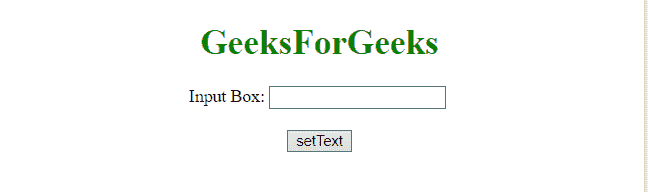

# JQuery |设置输入文本字段的值

> 原文:[https://www . geesforgeks . org/jquery-设置输入文本字段的值/](https://www.geeksforgeeks.org/jquery-set-the-value-of-an-input-text-field/)

有一个**输入元素**，任务是**使用 JQuery 设置**它的值。这里讨论几个例子。
了解例子首先要知道几个方法。
[**JQuery val()方法:**](https://www.geeksforgeeks.org/jquery-val-with-examples/)
此方法返回/设置所选元素的值属性。
如果我们用这个方法返回值，它会返回第一个选中元素的值。
如果我们用这个方法来设置值，它会为一组选定的元素设置一个或多个值属性。
**语法:**

*   **返回值属性:**

    ```
    $(selector).val()

    ```

*   **设置值属性:**

    ```
    $(selector).val(value)

    ```

*   **使用功能设置值属性:**

    ```
    $(selector).val(function(index, curValue))

    ```

**参数:**

*   **值:**此参数为必填项。它指定值属性的值。
*   **函数(索引，当前值):**此参数可选。它指定返回要设置的值的函数。
    *   **索引:**返回集合中元素的索引位置。
    *   **当前值:**返回所选元素的当前值属性。

**示例 1:** 在本示例中，输入元素的值由 **val()方法**通过从其 ID 中选择输入元素来设置。

```
<!DOCTYPE HTML>
<html>

<head>
    <title>
        JQuery | Set value of input text.
    </title>
    <script src=
"https://ajax.googleapis.com/ajax/libs/jquery/3.4.0/jquery.min.js">
    </script>

</head>

<body style="text-align: center;">
    <h1 style="color: green;">  
             GeeksForGeeks  
        </h1> Input Box:
    <input id="input" 
           type="text" 
           class="Disable" 
           value="" />
    <br>
    <br>
    <button id="setText">
        setText
    </button>
    <script>
        $("#setText").click(function(event) {
            $('#input').val("GeeksForGeeks");
        });
    </script>
</body>

</html>
```

**输出:**

*   **点击按钮前:**
    
*   **点击按钮后:**
    

**示例 2:** 在本示例中，输入元素的值由 **val()方法**设置，方法是从其父元素<主体>中选择输入元素，然后选择<输入>元素。

```
<!DOCTYPE HTML>
<html>

<head>
    <title>
        JQuery 
      | Set value of input text.
    </title>
    <script src=
"https://ajax.googleapis.com/ajax/libs/jquery/3.4.0/jquery.min.js">
    </script>

</head>

<body style="text-align: center;">
    <h1 style="color: green;">  
             GeeksForGeeks  
        </h1> Input Box:
    <input id="input"
           type="text" 
           class="Disable"
           value="" />
    <br>
    <br>
    <button id="setText">
        setText
    </button>
    <script>
        $("#setText").click(
          function(event) {
            $('body input').val(
              "GeeksForGeeks");
        });
    </script>
</body>

</html>
```

**输出:**

*   **点击按钮前:**
    
*   **点击按钮后:**
    

jQuery 是一个开源的 JavaScript 库，它简化了 HTML/CSS 文档之间的交互，它以其“少写多做”的理念而闻名。
跟随本 [jQuery 教程](https://www.geeksforgeeks.org/jquery-tutorials/)和 [jQuery 示例](https://www.geeksforgeeks.org/jquery-examples/)可以从头开始学习 jQuery。