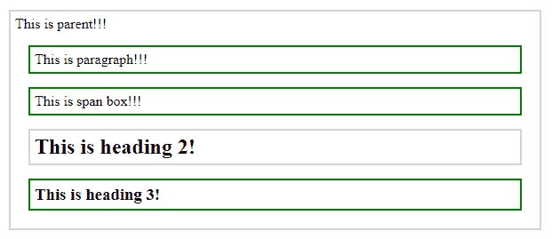
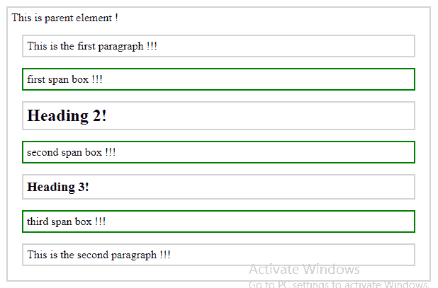

# jQuery |姐弟()带示例

> 原文:[https://www . geeksforgeeks . org/jquery-带示例的兄弟姐妹/](https://www.geeksforgeeks.org/jquery-siblings-with-examples/)

**兄弟()**是 jQuery 中的一个内置方法，用于查找所选元素的所有兄弟元素。兄弟元素是那些在 DOM 树中有相同父元素的元素。文档对象模型是一个万维网联盟标准。这是访问 DOM 树中元素的定义。
**语法:**

```
$(selector).siblings(function)

```

这里，选择器是将要找到其兄弟的选定元素。
**参数:**它接受一个可选的参数“函数”，该参数表示应该从所有兄弟中选择哪些兄弟。
**返回值:**返回所选元素的所有兄弟。

<center>**jQuery code to show the working of siblings() function:**</center>

**Code #1:**
In the below code, no parameter is passed to the siblings() function.

```
<html>

<head>
    <style>
        .sib * {
            display: block;
            border: 2px solid lightgray;
            color: black;
            padding: 5px;
            margin: 15px;
        }
    </style>
    <script src="https://ajax.googleapis.com/ajax/libs/
                  jquery/3.3.1/jquery.min.js"></script>
    <script>
        $(document).ready(function() {
            $("h2").siblings().css({
                "color": "black",
                "border": "2px solid green"
            });
        });
    </script>
</head>

<body class="sib">
    <div>
        This is parent!!!
        <p>This is paragraph!!!</p>
        <span>This is span box!!!</span>
        <h2>This is heading 2!</h2>
        <h3>This is heading 3!</h3>
    </div>
</body>

</html>
```

在上面的代码中，“h2”的所有兄弟都被高亮显示。
**输出:**


**代码#2:**
在下面的代码中，函数的一个可选参数用于过滤对兄弟的搜索。

```
<html>

<head>
    <style>
        .sib * {
            display: block;
            border: 2px solid lightgrey;
            color: black;
            padding: 5px;
            margin: 15px;
        }
    </style>
    <script src="https://ajax.googleapis.com/ajax/libs/
                  jquery/3.3.1/jquery.min.js"></script>
    <script>
        $(document).ready(function() {
            $("h2").siblings("span").css({
                "color": "black",
                "border": "2px solid green"
            });
        });
    </script>
</head>

<body class="sib">
    <div>
        This is parent element !
        <p>This is the first paragraph !!!</p>
        <span>first span box !!!</span>
        <h2>Heading 2!</h2>
        <span>second span box !!!</span>
        <h3>Heading 3!</h3>
        <span>third span box !!!</span>
        <p>This is the second paragraph !!!</p>
    </div>
</body>

</html>
```

在上面的代码中，元素名为“span”的“h2”的所有兄弟被选中。
**输出:**
