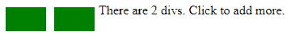
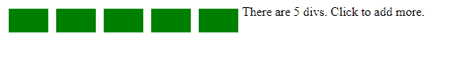

# jQuery | size()带示例

> 原文:[https://www.geeksforgeeks.org/jquery-size-with-examples/](https://www.geeksforgeeks.org/jquery-size-with-examples/)

**size()** 是 jQuery 中的一个内置方法，用于查找给定选择器匹配的元素数量。在 jQuery 3.0 中删除了这个方法，而不是引入了这个长度()。
**语法:**

```html
$(selector).size()

```

**参数:**不接受任何参数。

**返回值:**返回所选元素匹配的元素个数。

**jQuery 代码显示大小()方法的工作方式:**

```html
<html>

<head>
    <style>
        body {
            cursor: pointer;
            min-height: 100px;
        }

        div {
            width: 50px;
            height: 30px;
            margin: 5px;
            float: left;
            background: green;
        }

        span {
            color: black;
        }
    </style>
    <script src="https://code.jquery.com/jquery-1.10.2.js">
    </script>
</head>

<body>
    <div></div>
    <span></span>
    <!-- jQuery code to show the working of this method -->
    <script>
        $(document.body)
            .click(function() {
                $(this).append($("<div>"));
                var n = $("div").size();
                $("span").text("There are " + n + " divs. Click to add more.");
            })

        // Trigger the click to start
        .click();
    </script>

</body>

</html>
```

**输出:**
点击屏幕前-


在屏幕上点击三次后-
