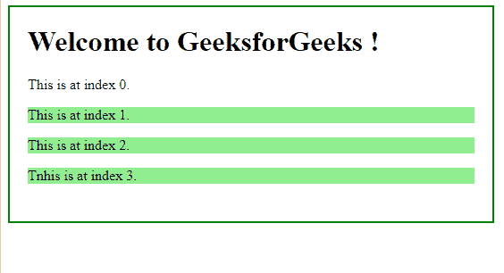

# jQuery | slice()带示例

> 原文:[https://www.geeksforgeeks.org/jquery-slice-with-examples/](https://www.geeksforgeeks.org/jquery-slice-with-examples/)

**切片()**是 jQuery 中的一个内置方法，用于根据元素的索引选择元素的子集。子集是一个集合，它可能是一个大集合的一部分。
**语法:**

```html
$(selector).slice(para1, para2)

```

**参数:**接受以下指定的两个参数-

*   **para1:** 指定从哪里开始选择元素。
*   **para2:** 可选，指定停止元素选择的位置。

**返回值:**返回所选元素的子集。

**显示 slice()方法工作情况的 jQuery 代码:**

```html
<html>

<head>
    <script 
    src="https://ajax.googleapis.com/ajax/libs/jquery/3.3.1/jquery.min.js">
    </script>
    <!-- jQuery code to show the working of this method -->
    <script>
        $(document).ready(function() {
            $("p").slice(1, 4).css("background-color", "lightgreen");
        });
    </script>
    <style>
        body {
            width: 500px;
            height: 200px;
            padding: 20px;
            border: 2px solid green;
        }
    </style>
</head>

<body>

    <h1>Welcome to GeeksforGeeks !</h1>

    <p>This is at index 0.</p>
    <p>This is at index 1.</p>
    <p>This is at index 2.</p>
    <p>Tnhis is at index 3.</p>

</body>

</html>
```

**输出:**
在这段代码中，从索引 1 到索引 3 的所有段落元素都被高亮显示。
