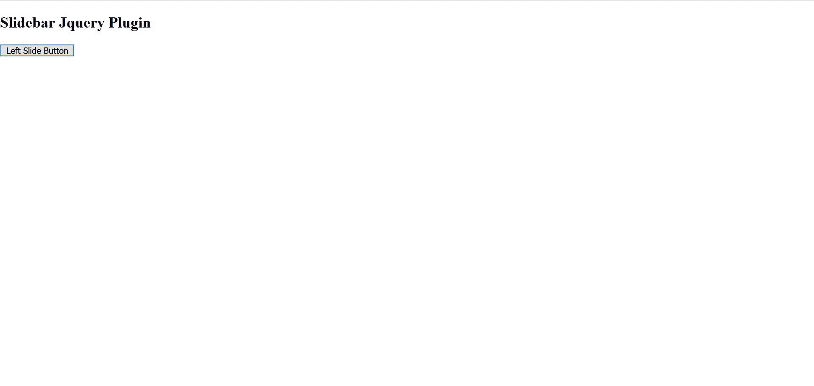
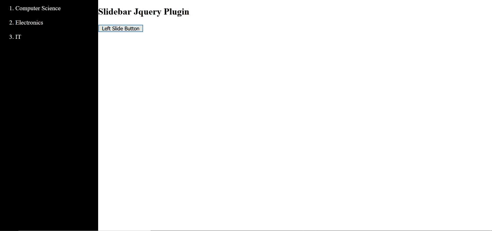

# jQuery Slidebar.js Plugin

> 原文:[https://www.geeksforgeeks.org/jquery-slidebar-js-plugin/](https://www.geeksforgeeks.org/jquery-slidebar-js-plugin/)

***JQuery*** 是一个小型、快速、丰富的 JavaScript 库，是 JavaScript 的优化版本。它为我们提供了一个简单的应用编程接口，有助于 HTML 文档的遍历和操作、事件处理、动画和 Ajax。jQuery 为我们提供了多种可以在网站上实现的插件，其中之一就是 *Slidebar.js.*

**Slidebar.js:** 这是一个 jQuery Plugin，可以帮助我们创建一个带有动画的 Slidebar。它有助于在我们的网站中实现移动应用风格的显示菜单和侧栏。

可以创建四种类型的滑杆:

1.  左侧边栏
2.  右滑动条
3.  顶部侧边栏
4.  底部侧边栏

在本文中，我们将学习如何在网站上实现左侧边栏。但在此之前，我们需要添加一些 cdn，以使滑杆工作。

**1。包含 jQuery CDN**

**2。包括 Slidebar.js CDNs(JS 和 CSS)**

> < link rel= "样式表" href = " https://cdnjs . cloudflare . com/Ajax/libs/slide bar/2 . 0 . 2/slide bar . min . CSS ">

现在，我们已经包括了所有必要的 cdn，让我们转向原始代码。

**示例:**

## 超文本标记语言

```html
<!DOCTYPE html>
<html>

<head>
    <title>Slidebar Demo</title>
    <link rel="stylesheet" href=
"https://cdnjs.cloudflare.com/ajax/libs/slidebars/2.0.2/slidebars.min.css">
    <script src=
        "https://code.jquery.com/jquery-3.5.1.min.js" 
        type="text/javascript">
    </script>

    <script src=
"https://cdnjs.cloudflare.com/ajax/libs/slidebars/2.0.2/slidebars.min.js"
        type="text/javascript">
    </script>
</head>

<body>
    <div canvas="container" class="slidebar-button">

        <!-- Creating a heading -->
        <h2>Slidebar Demo</h2>

        <!-- Creating a button, clicking on
            which the left slidebar will open -->
        <button class="js-toggle-left">
            Left Slide Button
        </button>
    </div>

    <div class="slidebar-content">
        <div off-canvas="left-slidebar left reveal">
            <ol>
                <li>Computer Science</li><br>
                <li>Electronics </li><br>
                <li>IT</li><br>
            </ol>
        </div>
    </div>

    <script>
        (function ($) {
            "use strict";

            // Creating an instance of Slidebars
            var controller = new slidebars();

            // Initialize Slidebars
            controller.init();

            // left Slidebar controls
            $('.js-toggle-left').on('click', function (event) {
                event.stopPropagation();
                controller.toggle('left-slidebar');
            });
            $(controller.events).on('opened', function () {
                $('[canvas="container"]')
                    .addClass('js-close-any-slidebar');
            });
            $(controller.events).on('closed', function () {
                $('[canvas="container"]')
                    .removeClass('js-close-any-slidebar');
            });
            $('body').on('click', '.js-close-any-slidebar', 
            function (event) {
                event.stopPropagation();
                controller.close();
            });
        })(jQuery);
    </script>
</body>

</html>
```

**输出:**

**点击按钮前:**



**点击按钮后:**

