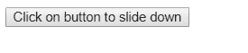
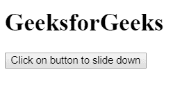

# jQuery | slideDown()方法

> 原文:[https://www.geeksforgeeks.org/jquery-slidedown-method/](https://www.geeksforgeeks.org/jquery-slidedown-method/)

jQuery 中的 **slideDown()方法**用于检查所选元素的可见性或显示隐藏的元素。它适用于两种类型的隐藏元素:

*   使用 jQuery 方法隐藏的元素。
*   使用显示隐藏的元素:在 CSS 中没有。

**语法:**

```html
$(selector).slideDown( speed, easing, callback )
```

**参数:**该方法接受三个参数，如上所述，如下所述:

*   **速度:**为可选参数，用于指定淡入淡出效果的速度。速度的默认值是 400 毫秒。速度的可能值有:
    *   毫秒
    *   “慢”
    *   “快”
*   **缓和:**是可选参数，用于指定元素到动画不同点的速度。宽松的默认值是“摇摆”。宽松政策的可能价值是:
    *   “摇摆”
    *   “线性”
*   **回调:**为可选参数。回调函数在 slideDown()方法完成后执行。

以下示例说明了 jQuery 中的 slideDown()方法:

**示例:**本示例使用 slideDown()方法显示隐藏元素。

```html
<!DOCTYPE html>
<html>

<head>
    <title>
        jQuery slideDown() Method
    </title>

    <script src=
"https://ajax.googleapis.com/ajax/libs/jquery/3.3.1/jquery.min.js">
    </script>

    <!-- Script to illustrate slideDown() method -->
    <script>
        $(document).ready(function() {
            $(".geek").click(function() {
                $("h1").slideDown();
            });
        });
    </script>
</head>

<body>

    <!-- hide element using CSS -->
    <h1 style = "display:none" >
        GeeksforGeeks
    </h1>

    <button class="geek">
        Click on button to slide down
    </button>
</body>

</html>                    
```

**输出:**
**点击按钮前:**

**点击按钮后:**
