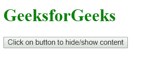
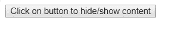

# jQuery | slideToggle()方法

> 原文:[https://www.geeksforgeeks.org/jquery-slidetoggle-method/](https://www.geeksforgeeks.org/jquery-slidetoggle-method/)

jQuery 中的 **slideToggle()方法**用于分别显示隐藏元素或隐藏可见元素，即在 slideUp()和 slideDown()方法之间切换。

*   当元素隐藏时，slideDown()运行。
*   当元素可见时，运行 slideUp()。

**语法:**

```
$(selector).slideToggle()( speed, easing, callback )
```

**参数:**该方法接受三个参数，如上所述，如下所述:

*   **速度:**为可选参数，用于指定淡入淡出效果的速度。速度的默认值是 400 毫秒。速度的可能值有:
    *   毫秒
    *   “慢”
    *   “快”
*   **缓和:**是可选参数，用于指定元素到动画不同点的速度。宽松的默认值是“摇摆”。宽松政策的可能价值是:
    *   “摇摆”
    *   “线性”
*   **回调:**为可选参数。回调函数在 slideToggle()方法完成后执行。

以下示例说明了 jQuery 中的 slideToggle()方法:

**示例:**本示例显示或隐藏元素。

```
<!DOCTYPE html>
<html>

<head>
    <title>
        jQuery slideToggle() Method
    </title>

    <script src=
"https://ajax.googleapis.com/ajax/libs/jquery/3.3.1/jquery.min.js">
    </script>

    <!-- Script to illustrates slideToggle() method -->
    <script>
        $(document).ready(function() {
            $("button").click(function() {
                $("h1").slideToggle();
            });
        });
    </script>
</head>

<body>

    <h1 style="color:green">
        GeeksforGeeks
    </h1>

    <button>
        Click on button to hide/show content
    </button>
</body>

</html>                    
```

**输出:**

*   **之前点击按钮:**
    
*   **点击按钮后:**
    
*   **双击按钮后:**
    