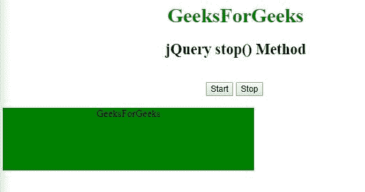

# jQuery |停止动画

> 哎哎哎:# t0]https://www . geeksforgeeks . org/jquery-stop-animations/

jQuery 中的 **jQuery stop()方法**用于在动画或效果完成之前停止动画或效果。
此方法适用于所有类型的动画，如滑动、淡入淡出和自定义动画。

**语法:**

```html
$(selector).stop(stopAll, goToEnd);
```

**示例-1:** 停止滑动动画。

```html
<!DOCTYPE html>
<html>

<head>
    <title>jQuery stop() Method
  </title>
    <script src=
"https://ajax.googleapis.com/ajax/libs/jquery/3.3.1/jquery.min.js">
  </script>
    <style>
        #panel,
        #flip {
            padding: 5px;
            font-size: 18px;
            text-align: center;
            background-color: green;
            color: white;
            border: solid 1px #666;
            border-radius: 3px;
        }

        #panel {
            padding: 50px;
            display: none;
        }
    </style>
</head>

<body>
    <center>
        <h1 style="color:green;">  
            GeeksForGeeks</h1>
        <h2 id="GFG">
          jQuery stop() Method</h2>
        <br>
        <button id="stop">Click
      </button>
        <br>
        <br>
        <div id="flip">
            <h2>GeeksForGeeks</h2></div>
        <div id="panel">
          A computer science portal for geeks
      </div>
        <script>
            $(document).ready(function() {
                $("#flip").click(function() {
                    $("#panel").slideDown(5000);
                });
                $("#stop").click(function() {
                    $("#panel").stop();
                });
            });
        </script>
    </center>
</body>

</html>
```

**输出:**

**点击极客前的头像:**


**点击极客头像后不点击按钮:**


**点击极客头像后点击按钮:**


**例-2:** 停止从左向右滑动。

```html
<!DOCTYPE html>
<html>

<head>
    <title>jQuery stop() Method</title>

    <script src=
"https://ajax.googleapis.com/ajax/libs/jquery/3.3.1/jquery.min.js">
  </script>

    <style>
        #panel,
        #flip {
            padding: 5px;
            font-size: 18px;
            text-align: center;
            background-color: green;
            color: white;
            border: solid 1px #666;
            border-radius: 3px;
        }

        #panel {
            padding: 50px;
            display: none;
        }
    </style>
</head>

<body>
    <center>
        <h1 style="color:green;">  
            GeeksForGeeks</h1>
        <h2 id="GFG"> jQuery stop() Method</h2>
        <br>
        <button id="start">Start</button>
        <button id="stop">Stop</button>
        <br>
        <br>
        <div style="background:green;
                    height:100px;
                    width:400px;
                    position:absolute;">
          GeeksForGeeks
      </div>
        <script>
            $(document).ready(function() {
                $("#start").click(function() {
                    $("div").animate({
                        left: '80px'
                    }, 5000);
                    $("div").animate({
                        fontSize: '3em'
                    }, 5000);
                });

                $("#stop").click(function() {
                    $("div").stop();
                });
            });
        </script>
    </center>
</body>

</html>
```

**输出:**

**点击开始前:**


**点击开始后不点击停止:**


**点击开始后点击停止:**
