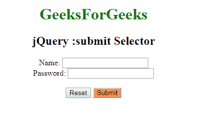

# jQuery |:提交选择器

> 原文:[https://www.geeksforgeeks.org/jquery-submit-selector/](https://www.geeksforgeeks.org/jquery-submit-selector/)

**:提交选择器**是一个内置的选择器，用于选择提交按钮和具有提交类型字段的输入元素。如果按钮的类型未定义，大多数标准浏览器将其用作**类型=“提交”**。

**语法:**

```
$(":submit")
```

**示例:**

```
<!DOCTYPE html>
<html>

<head>
    <script src=
   "https://ajax.googleapis.com/ajax/libs/jquery/3.3.1/jquery.min.js">
  </script>
    <script>
        $(document).ready(function() {

          $(":submit").css("background-color", 
                           "coral");
        });
    </script>
</head>

<body>
    <center>
        <h1 style="color:green;">GeeksForGees</h1>
        <h2>jQuery :submit Selector</h2>

        <form action="#">
            Name:
            <input type="text" name="user">
            <br> Password:
            <input type="password" name="password">
            <br>
            <br>
            <input type="reset" value="Reset">
            <input type="submit" value="Submit">
            <br>
        </form>
  </center>

</body>

</html>
```

**输出:**


**支持的浏览器:**支持的浏览器 **jQuery:提交选择器**如下:

*   谷歌 Chrome
*   微软公司出品的 web 浏览器
*   火狐浏览器
*   歌剧
*   旅行队