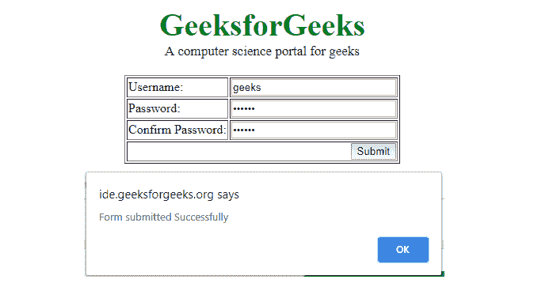
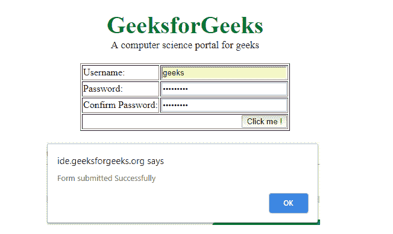

# jQuery |提交()并附示例

> 原文:[https://www.geeksforgeeks.org/jquery-submit-with-examples/](https://www.geeksforgeeks.org/jquery-submit-with-examples/)

submit()方法是 jQuery 中的一个内置方法，用于提交事件，或者在提交事件发生时附加一个要运行的函数。此方法只能应用于表单元素。
**语法:**

```
$(selector).submit(parameters);
```

**参数:**该方法的参数是可选的。

**返回值:**该方法返回选定的元素以及附加的事件。

**程序 1:** jQuery 代码显示 submit()方法的工作原理

```
<html>
    <head>
        <script src=
        "https://ajax.googleapis.com/ajax/libs/jquery/3.3.1/jquery.min.js">
        </script>
        <script>

            // jQuery code to show the working of this method
            $(document).ready(function() {
                $("form").submit(function() {
                    alert("Form submitted Successfully");
                });
            });
        </script>
        <style>
            .gfg {
                font-size:40px;
                color:green;
                font-weight:bold;
                text-align:center;
            }
            .geeks {
                font-size:17px;
                text-align:center;
                margin-bottom:20px;
            }
        </style>
    </head>
    <body>
        <div class = "gfg">GeeksforGeeks</div>
        <div class = "geeks">A computer science portal for geeks</div>
        <form action = "">
        <table border = 1 align = "center">
            <tr>
                <!-- Enter Username -->
                <td>Username:</td>
                <td><input type = text name = name size = 25</td>
            </tr>
            <tr>
                <!-- Enter Password. -->
                <td>Password:</td>
                <td><input type = password name = password1 size = 25</td>
            </tr>
            <tr>
                <!-- To Confirm Password. -->
                <td>Confirm Password:</td>
                <td><input type = password name = password2 size = 25></td>
            </tr>
            <tr>
                <td colspan = 2 align = right>
                <input type = submit value = "Submit"></td>
            </tr>
        </table>
        </form>
    </body>
</html>
```

**输出:**


**程序 2:**

```
<html>
    <head>
        <script src=
        "https://ajax.googleapis.com/ajax/libs/jquery/3.3.1/jquery.min.js">
        </script>
        <script>

            // jQuery code to show the working of this method
            $(document).ready(function() {
                $("form").submit(function() {
                    alert("Form submitted Successfully");
                });
                $("button").click(function() {
                    $("form").submit();
                });
            });
        </script>
        <style>
            .gfg {
                font-size:40px;
                color:green;
                font-weight:bold;
                text-align:center;
            }
            .geeks {
                font-size:17px;
                text-align:center;
                margin-bottom:20px;
            }
        </style>
    </head>
    <body>
        <div class = "gfg">GeeksforGeeks</div>
        <div class = "geeks">A computer science portal for geeks</div>
        <form action = "">
        <table border = 1 align = "center">
            <tr>
                <!-- Enter Username -->
                <td>Username:</td>
                <td><input type = text name = name size = 25</td>
            </tr>
            <tr>
                <!-- Enter Password. -->
                <td>Password:</td>
                <td><input type = password name = password1 size = 25</td>
            </tr>
            <tr>
                <!-- To Confirm Password. -->
                <td>Confirm Password:</td>
                <td><input type = password name = password2 size = 25></td>
            </tr>
            <tr>
                <td colspan = 2 align = right>
                <button>Click me !</button>
            </tr>
        </table>
        </form>
    </body>
</html>
```

**输出:**
