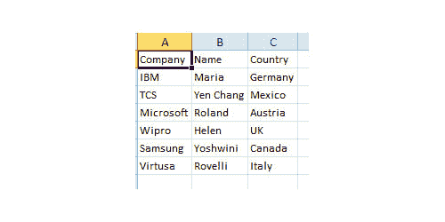
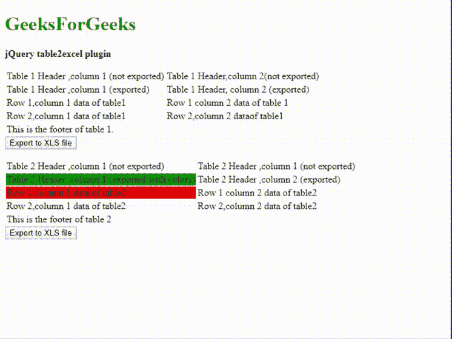
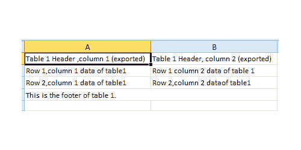
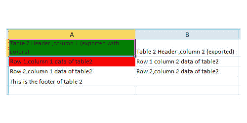

# jQuery | table2excel 插件

> 哎哎哎::1230【https://www . geeksforgeeks . org/jquery-table 2 excel 插件/

在网页设计和开发过程中，定期备份是一项重要的实践。jQuery 提供 **table2excel** 插件，帮助将 HTML 表格导出到 excel(。xls)文件。

请从 jQuery **table2excel** 插件下载所需的库文件，并将其包含在您的工作文件夹中，如下例所示。

**下载链接:**https://github . com/rainabba/jquery-table 2 excel

**示例 1:** 以下示例演示了 **table2excel** 插件的基本功能。表格内容和标题一起导出到“GFGFile.xls”文件。

```html
<!DOCTYPE html>
<html>
    <head>
        <title>jQuery table2excel plugin</title>
        <script src=
"https://ajax.googleapis.com/ajax/libs/jquery/2.2.4/jquery.min.js">
        </script>
        <script src="jquery.table2excel.js"></script>
    </head>
    <body>
        <h1 style="color:green">GeeksForGeeks</h1>
        <b>jQuery table2excel plugin </b>
        <p></p>
        <table id="myTable" class="table2excel">
            <tr>
             <th>Company</th>
             <th>Name</th>
             <th>Country</th>
            </tr>
              <tr>
                <td>IBM</td>
                <td>Maria</td>
                <td>Germany</td>
              </tr>
              <tr>
                <td>TCS</td>
                <td>Yen Chang</td>
                <td>Mexico</td>
              </tr>
              <tr>
                <td>Microsoft</td>
                <td>Roland</td>
                <td>Austria</td>
              </tr>
              <tr>
                <td>Wipro</td>
                <td>Helen</td>
                <td>UK</td>
              </tr>
              <tr>
                <td>Samsung</td>
                <td>Yoshwini</td>
                <td>Canada</td>
              </tr>
              <tr>
                <td>Virtusa</td>
                <td>Rovelli</td>
                <td>Italy</td>
              </tr>
        </table>        

        <script>
            $(function() {
                $("#myTable").table2excel({
                  name: "Backup file for HTML content",

                  //  include extension also
                  filename: "GFGFile.xls",

    // 'True' is set if background and font colors preserved
                  preserveColors: false 
              });        

            });
        </script>
    </body>
</html>
```

**输出:**

*   导出前:
    

*   在' GFGFile.xls '中导出后:
    

**示例 2:** 在以下示例中，解释了 **table2excel** 插件以及显示更多选项设置。在 HTML 结构中，两个表用于显示导出文件中的不同结果。该表的第 1 行标题不会导出到输出 excel 文件中，因为它们已被指定为“noExl”类，如下图所示。表 2 被分配了类“颜色类”，因此分配给任何 HTML 控件的颜色都被保留，如代码所示。程序员可以根据应用程序的要求设置选项。

```html
<!DOCTYPE html>
<html>
    <head>
        <title>jQuery table2excel plugin</title>
        <script src=
"https://ajax.googleapis.com/ajax/libs/jquery/2.2.4/jquery.min.js">
        </script>
        <script src="jquery.table2excel.js"></script>
    </head>
    <body>
        <h1 style="color:green">GeeksForGeeks</h1>
        <b>jQuery table2excel plugin </b>
        <p></p>
        <table class="table2excel">
            <thead>
                <tr class="noExl">
                <td>
                    Table 1 Header, column 1 (not exported)</td>
                   <td>Table 1 Header, column 2(not exported)
                </td>
              </tr>
                <tr><td>Table 1 Header, column 1 (exported)</td>
               <td>Table 1 Header, column 2 (exported)</td></tr>
            </thead>
            <tbody>
                <tr><td>Row 1, column 1 data of table1</td>
                <td>Row 1 column 2 data of table 1</td></tr>

                <tr><td>Row 2, column 1 data of table1</td>
                <td>Row 2, column 2 dataof table1</td></tr>
            </tbody>
            <tfoot>
                <tr><td colspan="2">This is the footer of table 1.</td></tr>
            </tfoot>
        </table>
        <button class="exportBtnClass">Export to XLS file</button><p></p>

        <table class="table2excel colorClass">
            <thead>
                <tr class="noExl">
                <td>Table 2 Header, column 1 (not exported)</td>
                <td>Table 2 Header, column 1 (not exported)</td></tr>

                <tr><td style="background-color: green;">
    Table 2 Header, column 1 (exported with colors)</td>
             <td>Table 2 Header, column 2 (exported)</td></tr>
            </thead>
            <tbody>
                <tr><td style="background-color: red;">
          Row 1, column 1 data of table2</td>
         <td>Row 1 column 2 data of table2</td></tr>
                <tr><td>Row 2, column 1 data of table2</td>
                <td>Row 2, column 2 data of table2</td></tr>

            </tbody>
            <tfoot>
                <tr><td colspan="2">
                This is the footer of table 2</td></tr>
            </tfoot>
        </table>
        <button class="exportBtnClass">
                  Export to XLS file
         </button>

        <script>
            $(function() {

                $(".exportBtnClass").click(function(e){
                    var table = $(this).prev('.table2excel');
                    if(table && table.length){
                        var preserveColors = 
                       (table.hasClass('colorClass') ? true : false);

                        $(table).table2excel({

// This class's content is excluded from getting exported
                            exclude: ".noExl", 
                            name: "Output excel file ",
                            filename: 
"outputFile-" + new Date().toString().replace(/[\-\:\.]/g, "") + ".xls",

                            fileext: ".xls", //File extension type
                            exclude_img: true,
                            exclude_links: true,
                            exclude_inputs: true,
                            preserveColors: preserveColors
                        });
                    }
                });        
            });
        </script>
    </body>
</html>
```

**输出:**

*   导出前:
    

*   表 1 导出后:
    

*   表 2 导出后:
    