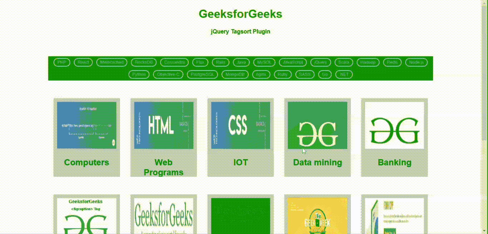
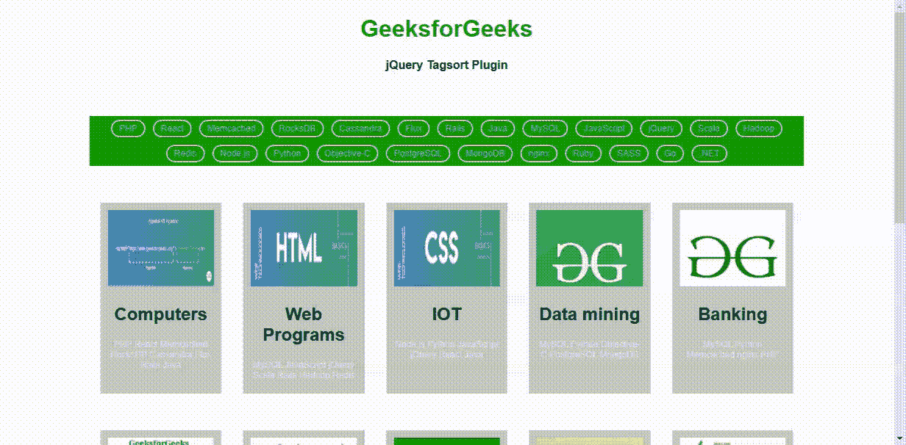
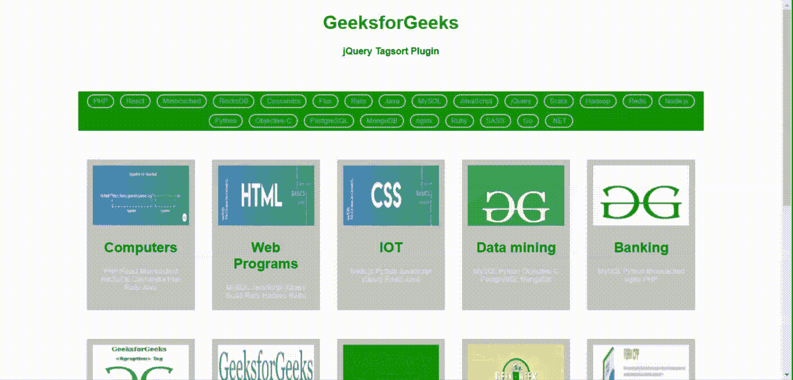
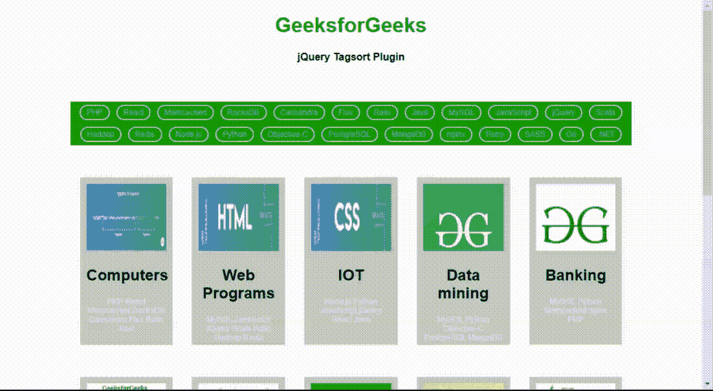

# jquery | tag port 插件

> 哎哎哎::1230【https://www . geeksforgeeks . org/jquery-tags port 插件/

jQuery 提供了**标签排序**插件，用于显示标签或基于 DOM 中不同标签的过滤元素。该插件采用 HTML 页面结构的数据属性，并动态创建用于过滤元素的用户友好标签。元素的过滤以多种方式完成，这些方式在 tagsort 插件提供的选项设置功能中处理。

**注意:**请从 [**Tagsort** 插件](https://github.com/wchaering/tagsort)下载以下库文件，并保存在您的工作文件夹中，以包含在您的代码中。请从这个[链接下载“jquery-3.2.1.min.js”文件。](https://code.jquery.com/jquery-3.2.1.min.js)

**jQuery 标签排序插件的链接:**

> <link href="”tagsort.css”" rel="”stylesheet”" type="”text/css”">
> <脚本 src = " jquery-3 . 2 . 1 . min . js "></脚本>
> <脚本 src = " tagsort . min . js "></脚本>

**示例 1:** 以下示例演示了 **tagsort** 插件的 tagSort()方法的基本用法，该插件采用*数据属性*，即“数据项标签”，包含许多用逗号(，)分隔的标签，这些标签被添加到要考虑进行过滤的项目中。它根据用户选择的标签显示所有相应的项目，如下图所示。

```
<!DOCTYPE html>
<html lang="en">

<head>
    <meta charset="UTF-8">
    <title>jQuery Tagsort Plugin</title>

    <style>
        html,
        body {
            margin: 0;
            padding: 0;
        }

        body {
            text-align: center;
            background-color: #FFF;
            font-family: "HelveticaNeue-Light", "Helvetica Neue",
                         Helvetica, Arial, sans-serif;
            font-weight: 300;
        }

        .height {
            height: 10px;
        }

        .container {
            width: 80%;
            margin: 0 auto;
        }

        h1 > small a {
            color: #AAA;
            text-decoration: none;
            font-size: 70%;
            margin-left: 10px;
        }

        .item {
            box-sizing: border-box;
            float: left;
            width: 20%;
            position: relative;
            min-height: 2px;
            padding-left: 15px;
            padding-right: 15px;
            margin-bottom: 50px;
            height: 220px;
            max-height: 350px;
            overflow: hidden;
        }

        .item .wrapper {
            background-color: #C3C3C3;
            height: 100%;
            padding: 10px;
        }

        .item .wrapper img {
            width: 100%;
            height: 60%
        }

        .item .wrapper .item-tags {
            color: #eee;
            font-size: 12px;
        }

        .tagsort-tags-container {
            margin: 50px 0;
        }
    </style>

    <link href="tagsort.css" rel="stylesheet" 
          type="text/css"></link>
    <script src="jquery-3.2.1.min.js" 
            type="text/javascript" charset="utf-8">
    </script>
    <script src="tagsort.min.js" 
            type="text/javascript" charset="utf-8">
    </script>

    <script>
        $(function() {

            $('div.tagsort-tags-container').tagSort({
                items: '.item-to-filter'
            });
        });
    </script>
</head>

<body>
    <h1 style="color:green">GeeksforGeeks </h1>
    <b> jQuery Tagsort Plugin </b>
    <div class="height"></div>

    <div class="container">

        <div class="tagsort-tags-container row" 
             style="background-color:green"></div>
        <div class="item-to-filter item col-md-3" 
             data-item-id="1"
             data-item-tags=
"PHP, React, Memcached, RocksDB, Cassandra, Flux, Rails, Java">
            <div class="wrapper">
                
                <h2>Computers</h2>
                <p class="item-tags"></p>
            </div>
        </div>

        <div class="item-to-filter item col-md-3"
             data-item-id="2" 
             data-item-tags=
"MySQL, JavaScript, jQuery, Scala, Rails, Hadoop, Redis">
            <div class="wrapper">
                
                <h2>Web Programs</h2>
                <p class="item-tags"></p>
            </div>
        </div>

        <div class="item-to-filter item col-md-3" 
             data-item-id="3" 
             data-item-tags=
"Node.js, Python, JavaScript, jQuery, React, Java">
            <div class="wrapper">
                
                <h2>IOT</h2>
                <p class="item-tags"></p>
            </div>
        </div>

        <div class="item-to-filter item col-md-3"
             data-item-id="4" 
             data-item-tags=
"MySQL, Python, Objective-C, PostgreSQL, MongoDB">
            <div class="wrapper">
                
                <h2>Data mining</h2>
                <p class="item-tags"></p>
            </div>
        </div>

        <div class="item-to-filter item col-md-3"
             data-item-id="5" 
             data-item-tags=
"MySQL, Python, Memcached, nginx, PHP">
            <div class="wrapper">
                
                <h2>Banking</h2>
                <p class="item-tags"></p>
            </div>
        </div>

        <div class="item-to-filter item col-md-3" 
             data-item-id="6" 
             data-item-tags=
"Python, Java, jQuery, Cassandra, Hadoop, PostgreSQL, Ruby">
            <div class="wrapper">
                
                <h2>Artificial Intelligence</h2>
                <p class="item-tags"></p>
            </div>
        </div>

        <div class="item-to-filter item col-md-3" 
             data-item-id="7" 
             data-item-tags=
"Javascript, jQuery, Redis, nginx, Rails, SASS">
            <div class="wrapper">
                
                <h2>Health care</h2>
                <p class="item-tags"></p>
            </div>
        </div>

        <div class="item-to-filter item col-md-3"
             data-item-id="8" 
             data-item-tags=
"Go, Ruby, MySQL, Redis, Memcached, SASS, Rails, nginx">
            <div class="wrapper">
                
                <h2>Digital marketing</h2>
                <p class="item-tags"></p>
            </div>
        </div>

        <div class="item-to-filter item col-md-3" 
             data-item-id="9" 
             data-item-tags=
"Ruby, MySQL, Hadoop, nginx, PHP, Scala, Memcached">
            <div class="wrapper">
                
                <h2>SEO</h2>
                <p class="item-tags"></p>
            </div>
        </div>

        <div class="item-to-filter item col-md-3" 
             data-item-id="10" 
             data-item-tags=
"nginx, MySQL, Redis, Rails, Ruby, Hadoop, PHP">
            <div class="wrapper">
                
                <h2>Low level programming</h2>
                <p class="item-tags"></p>
            </div>
        </div>

        <div class="item-to-filter item col-md-3" 
             data-item-id="11" 
             data-item-tags=
"JavaScript, Python, jQuery, Redis, Java, Go, Cassandra, .NET, MongoDB">
            <div class="wrapper">
                
                <h2>Stock Exchange</h2>
                <p class="item-tags"></p>
            </div>
        </div>

        <div class="item-to-filter item col-md-3" 
             data-item-id="12" 
             data-item-tags=
"nginx, Redis, Python, Java, JavaScript, Scala, Cassandra">
            <div class="wrapper">
                
                <h2>Reporting</h2>
                <p class="item-tags"></p>
            </div>

        </div>
    </div>
</body>

</html>
```

**输出:**


**示例 2:** 以下示例演示了由 **tagsort 插件**使用 javascript 提供的选项设置功能。选项*项目视图*设置为。item-tags ’,以便“数据项-tags”的所有不同标签都显示在类“item-tags”的“p”元素中，如输出图像所示。程序员可以根据应用程序的要求使用其他选项。

```
<!DOCTYPE html>
<html lang = "en">
   <head>
      <meta charset = "UTF-8">
      <title>jQuery Tagsort Plugin</title>        

      <style>
         html, body {
            margin: 0;
            padding: 0;
         }

         body {
            text-align:center;
            background-color: #FFF;
            font-family: 
"HelveticaNeue-Light", "Helvetica Neue", Helvetica, Arial, sans-serif; 
            font-weight: 300;
         }
         .height{
          height:10px;
         }

         .container {
            width: 80%;
            margin: 0 auto;
         }

         h1 > small a {
            color: #AAA;
            text-decoration: none;
            font-size: 70%;
            margin-left: 10px;
         }

         .item {
            box-sizing: border-box;
            float: left;
            width: 20%;
            position: relative;
            min-height: 2px;
            padding-left: 15px;
            padding-right: 15px;
            margin-bottom: 50px;
            height: 260px;
            max-height: 350px;
            overflow: hidden;
         }

         .item .wrapper {
            background-color: #C3C3C3;
            height: 100%;
            padding: 10px;

         }

         .item .wrapper img {
            width: 100%;
            height:40%
         }

         .item .wrapper .item-tags {
            color: #eee;
            font-size: 12px;            
         }

         .tagsort-tags-container {
            margin: 50px 0;
         }

      </style>

      <link href = "tagsort.css" 
            rel = "stylesheet" 
            type = "text/css"></link>        
      <script src = "jquery-3.2.1.min.js" 
               type = "text/javascript" charset = "utf-8"> 
</script>     
      <script src = "tagsort.min.js" 
              type = "text/javascript" 
              charset = "utf-8">  </script>      
      <script>
         $(function(){

           $('div.tagsort-tags-container').tagSort({
               items:'.item-to-filter',
               displaySelector: '.item-tags',
               displaySeperator: ' / ',
               tagElement: 'span',
               tagClassPrefix: false,
               itemTagsView: '.item-tags',
               itemTagsSeperator: ' ',
               itemTagsElement: false,
// Exclusive sorting display elements having all the selected tags
// Inclusive sorting display elements having any of the selected tags
// Single sorting allows only one tag selection by the user 
               sortType: 'exclusive',
               tagAttr: 'data-item-tags',
               fadeTime: 200,  
           });
        });

      </script>
   </head>

   <body>
      <h1 style="color:green">GeeksforGeeks </h1> 
       <b> jQuery Tagsort Plugin </b>
       <div class="height"></div>          
      <div class = "container">

         <div class = "tagsort-tags-container row" 
          style="background-color:green"></div>            
         <div class = "item-to-filter item col-md-3"
              data-item-id = "1" 
            data-item-tags = 
"PHP, React, Memcached, RocksDB, Cassandra, Flux, Rails, Java">
            <div class = "wrapper">
               
               <h2>Computers</h2>
               <p class = "item-tags"></p>
            </div>
         </div>

         <div class = "item-to-filter item col-md-3"
              data-item-id = "2"  
            data-item-tags =
 "MySQL, JavaScript, jQuery, Scala, Rails, Hadoop, Redis">
            <div class = "wrapper">
               
               <h2>Web Programs</h2>
               <p class = "item-tags"></p>
            </div>
         </div>

         <div class = "item-to-filter item col-md-3" 
              data-item-id = "3" 
            data-item-tags = 
"Node.js, Python, JavaScript, jQuery, React, Java">
            <div class = "wrapper">
               
               <h2>IOT</h2>
               <p class = "item-tags"></p>
            </div>
         </div>

         <div class = 
"item-to-filter item col-md-3" data-item-id = "4" 
            data-item-tags =
 "MySQL, Python, Objective-C, PostgreSQL, MongoDB">
            <div class = "wrapper">
               
               <h2>Data mining</h2>
               <p class = "item-tags"></p>
            </div>
         </div>

         <div class = 
"item-to-filter item col-md-3" data-item-id = "5" 
            data-item-tags = 
"MySQL, Python, Memcached, nginx, PHP">
            <div class = "wrapper">
               
               <h2>Banking</h2>
               <p class = "item-tags"></p>
            </div>
         </div>

         <div class = 
"item-to-filter item col-md-3" data-item-id = "6" 
            data-item-tags = 
"Python, Java, jQuery, Cassandra, Hadoop, PostgreSQL, Ruby">
            <div class = "wrapper">
               
               <h2>Artificial Intelligence</h2>
               <p class = "item-tags"></p>
            </div>
         </div>

         <div class = 
"item-to-filter item col-md-3" data-item-id = "7" 
            data-item-tags = 
"Javascript, jQuery, Redis, nginx, Rails, SASS">
            <div class = "wrapper">
               
               <h2>Health care</h2>
               <p class = "item-tags"></p>
            </div>
         </div>

         <div class = 
"item-to-filter item col-md-3" data-item-id = "8" 
            data-item-tags = 
"Go, Ruby, MySQL, Redis, Memcached, SASS, Rails, nginx">
            <div class = "wrapper">
               
               <h2>Digital marketing</h2>
               <p class = "item-tags"></p>
            </div>
         </div>

         <div class = 
"item-to-filter item col-md-3" data-item-id = "9" 
            data-item-tags = 
"Ruby, MySQL, Hadoop, nginx, PHP, Scala, Memcached">
            <div class = "wrapper">
               
               <h2>SEO</h2>
               <p class = "item-tags"></p>
            </div>
         </div>

         <div class = 
"item-to-filter item col-md-3" data-item-id = "10"
            data-item-tags = 
"nginx, MySQL, Redis, Rails, Ruby, Hadoop, PHP">
            <div class = "wrapper">
               
               <h2>Low level programming</h2>
               <p class = "item-tags"></p>
            </div>
         </div>

         <div class = "item-to-filter item col-md-3" data-item-id = "11" 
            data-item-tags = 
"JavaScript, Python, jQuery, Redis, Java, Go, Cassandra, .NET, MongoDB">
            <div class = "wrapper">
               
               <h2>Stock Exchange</h2>
               <p class = "item-tags"></p>
            </div>
         </div>

         <div class = "item-to-filter item col-md-3" data-item-id = "12" 
            data-item-tags = 
"nginx, Redis, Python, Java, JavaScript, Scala, Cassandra">
            <div class = "wrapper">
               
               <h2>Reporting</h2>
               <p class = "item-tags"></p>
            </div>

         </div>
      </div>
   </body>
</html>
```

**输出:**


**示例 3:** 下面的示例使用如下实现的 javascript 代码演示了多个 tagsorts 函数。结果显示在同一个页面中，具体取决于用户选择的多个标签。

```
<!DOCTYPE html>
<html lang = "en">
   <head>
      <meta charset = "UTF-8">
      <title>jQuery Tagsort Plugin</title>        

      <style>
         html, body {
            margin: 0;
            padding: 0;
         }

         body {
            text-align:center;
            background-color: #FFF;
            font-family: "HelveticaNeue-Light", "Helvetica Neue",
                          Helvetica, Arial, sans-serif; 
            font-weight: 300;
         }
         .height{
          height:10px;
         }

         .container {
            width: 80%;
            margin: 0 auto;
         }

         h1 > small a {
            color: #AAA;
            text-decoration: none;
            font-size: 70%;
            margin-left: 10px;
         }

         .item {
            box-sizing: border-box;
            float: left;
            width: 20%;
            position: relative;
            min-height: 2px;
            padding-left: 15px;
            padding-right: 15px;
            margin-bottom: 50px;
            height: 260px;
            max-height: 350px;
            overflow: hidden;
         }

         .item .wrapper {
            background-color: #C3C3C3;
            height: 100%;
            padding: 10px;

         }

         .item .wrapper img {
            width: 100%;
            height:40%
         }

         .item .wrapper .item-tags {
            color: #eee;
            font-size: 12px;            
         }

         .tagsort-tags-container {
            margin: 50px 0;
         }

      </style>

      <link href = "tagsort.css" 
rel = "stylesheet" type = "text/css"></link>        
      <script src = "jquery-3.2.1.min.js" 
type = "text/javascript" charset = "utf-8"> </script>     
      <script src = "tagsort.min.js" 
 type = "text/javascript" charset = "utf-8">  </script>      

      <script>
        $().ready(function() {
    $('div.tagsort-tags-container').each(function() {
        $(this).tagSort({
            items: '.item-to-filter',
            itemTagsView: '.item-tags',
            tagAttr: this.getAttribute("tagname") || "data-item-tags"
        });
    });
});

      </script>
   </head>

   <body>
      <h1 style="color:green">GeeksforGeeks </h1> 
       <b> jQuery Tagsort Plugin </b>
       <div class="height"></div>

      <div class = "container">

         <div class = 
"tagsort-tags-container row" style="background-color:green"></div>            
         <div class = "item-to-filter item col-md-3" data-item-id = "1" 
            data-item-tags = 
"PHP, React, Memcached, RocksDB, Cassandra, Flux, Rails, Java">
            <div class = "wrapper">
               
               <h2>Computers</h2>
               <p class = "item-tags"></p>
            </div>
         </div>

         <div class = "item-to-filter item col-md-3" data-item-id = "2"  
            data-item-tags = 
"MySQL, JavaScript, jQuery, Scala, Rails, Hadoop, Redis">
            <div class = "wrapper">
               
               <h2>Web Programs</h2>
               <p class = "item-tags"></p>
            </div>
         </div>

         <div class = 
"item-to-filter item col-md-3" data-item-id = "3" 
            data-item-tags = 
"Node.js, Python, JavaScript, jQuery, React, Java">
            <div class = "wrapper">
               
               <h2>IOT</h2>
               <p class = "item-tags"></p>
            </div>
         </div>

         <div class = "item-to-filter item col-md-3" data-item-id = "4" 
            data-item-tags = 
"MySQL, Python, Objective-C, PostgreSQL, MongoDB">
            <div class = "wrapper">
               
               <h2>Data mining</h2>
               <p class = "item-tags"></p>
            </div>
         </div>

         <div class = "item-to-filter item col-md-3" data-item-id = "5" 
            data-item-tags = "MySQL, Python, Memcached, nginx, PHP">
            <div class = "wrapper">
               
               <h2>Banking</h2>
               <p class = "item-tags"></p>
            </div>
         </div>

         <div class = "item-to-filter item col-md-3"
             data-item-id = "6" 
            data-item-tags = 
"Python, Java, jQuery, Cassandra, Hadoop, PostgreSQL, Ruby">
            <div class = "wrapper">
               
               <h2>Artificial Intelligence</h2>
               <p class = "item-tags"></p>
            </div>
         </div>

         <div class = 
"item-to-filter item col-md-3" data-item-id = "7" 
            data-item-tags = 
"Javascript, jQuery, Redis, nginx, Rails, SASS">
            <div class = "wrapper">
               
               <h2>Health care</h2>
               <p class = "item-tags"></p>
            </div>
         </div>

         <div class = 
"item-to-filter item col-md-3" data-item-id = "8" 
            data-item-tags = 
"Go, Ruby, MySQL, Redis, Memcached, SASS, Rails, nginx">
            <div class = "wrapper">
               
               <h2>Digital marketing</h2>
               <p class = "item-tags"></p>
            </div>
         </div>

         <div class = "item-to-filter item col-md-3" data-item-id = "9" 
            data-item-tags = 
"Ruby, MySQL, Hadoop, nginx, PHP, Scala, Memcached">
            <div class = "wrapper">
               
               <h2>SEO</h2>
               <p class = "item-tags"></p>
            </div>
         </div>

         <div class = 
"item-to-filter item col-md-3" data-item-id = "10"
            data-item-tags = "nginx, MySQL, Redis, Rails, Ruby, Hadoop, PHP">
            <div class = "wrapper">
               
               <h2>Low level programming</h2>
               <p class = "item-tags"></p>
            </div>
         </div>

         <div class = "item-to-filter item col-md-3" data-item-id = "11" 
            data-item-tags = 
"JavaScript, Python, jQuery, Redis, Java, Go, Cassandra, .NET, MongoDB">
            <div class = "wrapper">
               
               <h2>Stock Exchange</h2>
               <p class = "item-tags"></p>
            </div>
         </div>

         <div class = "item-to-filter item col-md-3" data-item-id = "12" 
            data-item-tags = 
"nginx, Redis, Python, Java, JavaScript, Scala, Cassandra">
            <div class = "wrapper">
               
               <h2>Reporting</h2>
               <p class = "item-tags"></p>
            </div>

         </div>
      </div>
   </body>
</html>
```

**输出:**

选择标签“Python”和“Objective-C”时:



当选择“PHP”和“Memcached”标签时:

