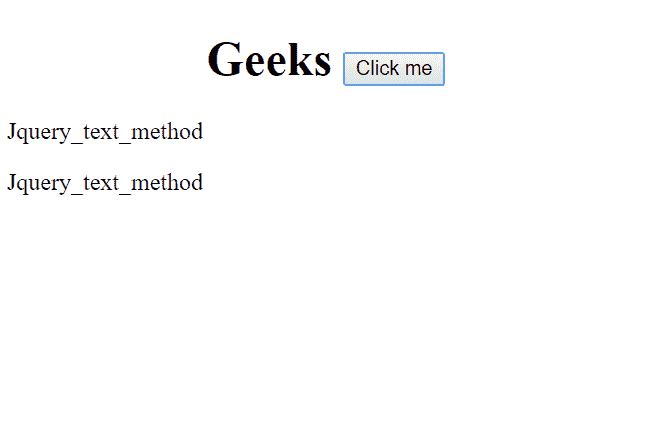
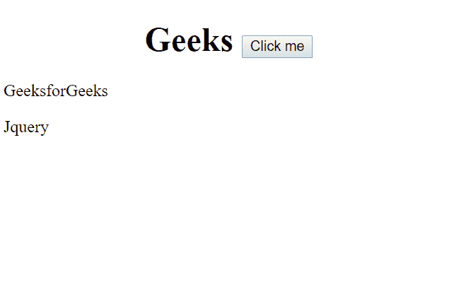
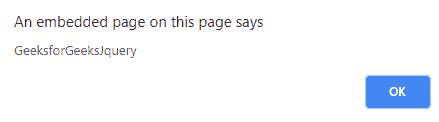
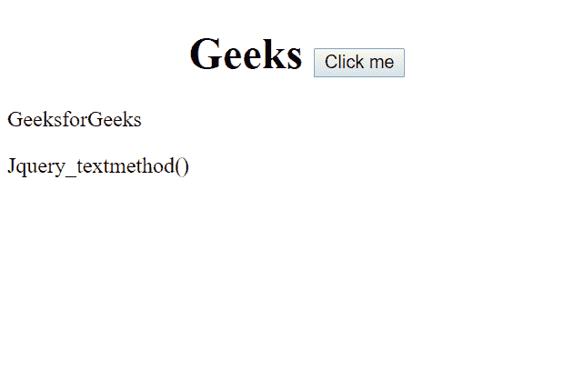
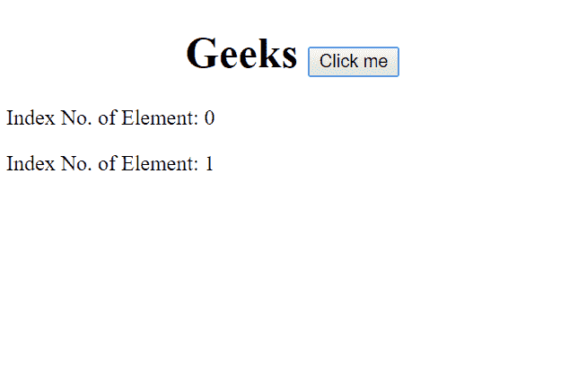

# jQuery | text()方法

> 原文:[https://www.geeksforgeeks.org/jquery-text-method/](https://www.geeksforgeeks.org/jquery-text-method/)

此方法用于**设置**或**返回**元素的文本内容。设置内容时，它会覆盖所有匹配元素的内容。text 方法()返回的内容用于返回所有匹配元素的文本内容。

**语法:**

*   **返回文本语法:**

    ```
    $(selector).text()
    ```

*   **设置文本语法:**

    ```
    $(selector).text(content)
    ```

*   **使用功能设置文本:**

    ```
    $(selector).text(function(index, currentcontent))
    ```

**属性值:**

1.  **所需内容:**用于设置元素的新文本内容。
2.  **函数(index，currentcontent):** 用于指定一个函数，该函数将返回所选元素的新文本内容。
    *   **索引**:返回元素的索引位置。
    *   **currentcontent** :返回元素的当前内容。

**示例-1:** 设置文本语法。

```
<!DOCTYPE html>
<html>

<body>
    <h1>
      <center>
    Geeks <button onclick="function()">Click me
        </button>
      </center>
  </h1>

    <script src=
"https://ajax.googleapis.com/ajax/libs/jquery/3.3.1/jquery.min.js">
  </script>
    <script>
        $(document).ready(function() {
            $("button").click(function() {
                $("p").text("Jquery_text_method");
            });
        });
    </script>

    <p>GeeksforGeeks</p>
    <p>Jquery</p>

</body>

</html>
```

**输出:**

**点击按钮前:**


**点击按钮后:**


**示例-2:** 返回文本语法。

```
<!DOCTYPE html>
<html>

<body>
    <h1>
      <center>
     Geeks <button onclick="function()">Click me
        </button>
      </center> 
  </h1>

    <script src=
"https://ajax.googleapis.com/ajax/libs/jquery/3.3.1/jquery.min.js">
  </script>
    <script>
        $(document).ready(function() {
            $("button").click(function() {
                alert($("p").text());
            });
        });
    </script>

    <p>GeeksforGeeks</p>
    <p>Jquery</p>

</body>

</html>
```

**输出:**

**点击按钮前:**


**点击按钮后:**


**示例-3:** 使用函数设置文本。

```
<!DOCTYPE html>
<html>

<body>
    <h1>
      <center>
      Geeks <button onclick="function()">Click me
        </button>
      </center>
  </h1>
    <script 
src="https://ajax.googleapis.com/ajax/libs/jquery/3.3.1/jquery.min.js">
  </script>

    <script>
        $(document).ready(function() {
            $("button").click(function() {
                $("p").text(function(n) {
                return "Index No. of Element: " + n;
                });
            });
        });
    </script>

    <p>GeeksforGeeks</p>
    <p>Jquery_textmethod()</p>

</body>

</html>
```

**输出:**

**点击按钮前:**


**点击按钮后:**
