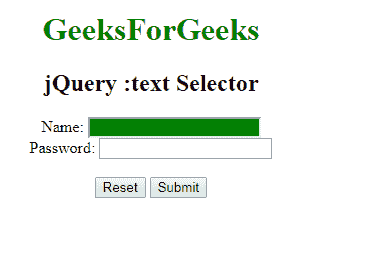

# jQuery |:文本选择器

> 原文:[https://www.geeksforgeeks.org/jquery-text-selector/](https://www.geeksforgeeks.org/jquery-text-selector/)

**:文本选择器**用于选择带有文本字段的输入元素，即(类型= =文本)。

**语法:**

```html
$(":text") 
```

**示例:**

```html
<!DOCTYPE html>
<html>

<head>
    <script src=
"https://ajax.googleapis.com/ajax/libs/jquery/3.3.1/jquery.min.js">
  </script>

  <script>
    $(document).ready(function() {
        $(":text").css("background-color",
                      "green");
        });
    </script>
</head>

<body>
    <center>
        <h1 style="color:green;">
          GeeksForGeeks
      </h1>
        <h2>jQuery :text Selector
      </h2>

        <form action="">
            Name:
            <input type="text" 
                   name="user">
            <br> Password:
            <input type="password" 
                   name="password">
            <br>
            <br>
            <input type="reset"
                   value="Reset">
            <input type="submit" 
                   value="Submit">
            <br>
        </form>
  </center>
</body>

</html>
```

**输出:**


**支持的浏览器:**T2 jQuery:文本选择器支持的浏览器如下:

*   谷歌 Chrome
*   微软公司出品的 web 浏览器
*   火狐浏览器
*   歌剧
*   旅行队