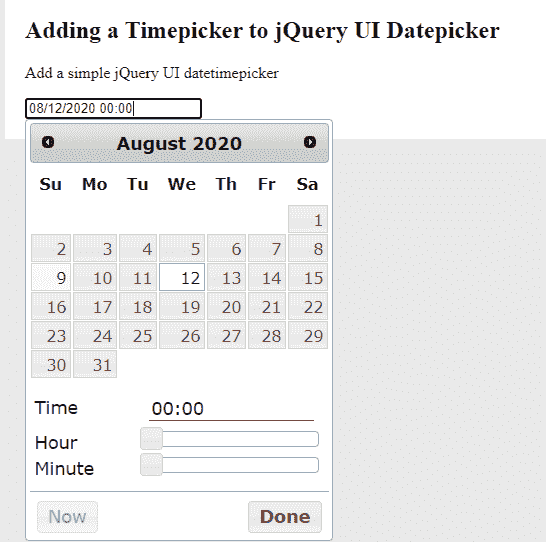

# jQuery Timepicker 外挂程式

> 哎哎哎:# t0]https://www . geeksforgeeks . org/jquery-time picker 外挂程式/

在本文中，我们将学习如何使用 jQuery **Timepicker-Addon** 图像插件向 jQueryUI Datepicker 添加时间选择器。

**注意:**请下载工作文件夹中的 jQuery[**time picker**](https://github.com/trentrichardson/jQuery-Timepicker-Addon)插件，并将需要的文件包含在你的 HTML 代码的头部。

> <link href="”http://code.jquery.com/ui/1.11.0/themes/smoothness/jquery-ui.css”" rel="”stylesheet”" type="”text/css”/">
> <链接 href = " jquery-ui-time picker-addon . CSS " rel = " style sheet " type = " text/CSS "/>
> 
> <脚本 src = " http://code . jquery . com/ui/1 . 11 . 0/jquery-ui . min . js "></脚本>
> <脚本 src = " jquery-ui-time picker-addon . js "></脚本>

**示例 1:** 以下示例演示了插件的 jQuery **datetimepicker()** 方法的实例化。

```html
<!DOCTYPE html>
<html lang="en" 
      xmlns="http://www.w3.org/1999/xhtml">
    <head>
        <meta http-equiv="Content-Type" 
              content="text/html; charset=UTF-8" />
        <title>Adding a Timepicker to 
          jQuery UI Datepicker</title>

        <style type="text/css">
            body {
                margin: 0;
                padding: 20px;
                border: 0;
                background-color: #e9e9e9;
                border-top: solid 10px #7ba9b2;
                font: Arial, sans-serif;
            }
            .wrapper {
                width: 800px;
                border: solid 1px #eeeeee;
                background-color: #ffffff;
                padding: 20px;
                margin: 0 auto;
            }
        </style>

        <link
            rel="stylesheet"
            media="all"
            type="text/css"
            href="http://code.jquery.com/ui/1.11.0/themes/
               smoothness/jquery-ui.css"
        />
        <link rel="stylesheet"
              media="all"
              type="text/css" 
              href="jquery-ui-timepicker-addon.css" />
    </head>
    <body>
        <div class="wrapper">
            <h2>Adding a Timepicker to
              jQuery UI Datepicker</h2>
            <div class="container">
                <p>Add a simple jQuery 
                  UI datetimepicker</p>
                <div>
                    <input type="text" 
                           name="dateTimePicker" 
                           id="dateTimePicker" 
                           value="" />
                </div>
            </div>
        </div>
        <script type="text/javascript" 
                src=
       "http://code.jquery.com/jquery-1.11.1.min.js">
      </script>
        <script type="text/javascript" 
                src=
        "http://code.jquery.com/ui/1.11.0/jquery-ui.min.js">
      </script>
        <script type="text/javascript" 
                src="jquery-ui-timepicker-addon.js">
      </script>

        <script type="text/javascript">
            // Initialization of datetimepicker
            $(function () {
                $("#dateTimePicker").datetimepicker();
            });
        </script>
    </body>
</html>
```

**输出:**


**在 jQuery UI Datepicker 中添加 time picker:**在上面的 HTML 代码中，我们可以为“timeFormat”、“timezonelist”和本地化添加以下设置。根据需要，程序员可以使用更多的选项。

```html
<script>
$(function(){

               $('#timePicker').datetimepicker({
                timeFormat: "hh:mm tt", //timezone format
                timezoneList: [ 
                 { value: -300, label: 'Eastern'}, 
                 { value: -360, label: 'Central' }, 
                 { value: -420, label: 'Mountain' }, 
                 { value: -480, label: 'Pacific' } 
               ]
              });
               $('#timePicker').timepicker(
              //$.timepicker.regional["localization code"]
               $.timepicker.regional['en']//English
              );              

            });
</script>
```

**示例 2:** 下面的示例演示了滑块功能，其步进时间间隔为 1 小时、1 分钟和 1 秒钟。为了更好的理解，请参考输出。移动滑块后，它会在时间选项设置中提到的时间间隔内跳跃，如下所示。

**注意:**请不要忘记在您的 HTML 代码中包含以下用于滑块功能的库。

> <脚本 src = " jquery-ui-slideraccess . js "></脚本>

```html
<!DOCTYPE html>
<html lang="en" 
      xmlns="http://www.w3.org/1999/xhtml">
    <head>
        <meta http-equiv="Content-Type" 
              content="text/html; charset=UTF-8" />
        <title>Adding a Timepicker to
          jQuery UI Datepicker</title>

        <style type="text/css">
            body {
                margin: 0;
                padding: 20px;
                border: 0;
                background-color: #e9e9e9;
                border-top: solid 10px #7ba9b2;
                font: Arial, sans-serif;
            }

            .wrapper {
                width: 800px;
                border: solid 1px #eeeeee;
                background-color: #ffffff;
                padding: 20px;
                margin: 0 auto;
            }
        </style>
        <link
            rel="stylesheet"
            media="all"
            type="text/css"
            href="http://code.jquery.com/ui/1.11.0/
               themes/smoothness/jquery-ui.css"
        />
        <link rel="stylesheet" 
              media="all"
              type="text/css"
              href="jquery-ui-timepicker-addon.css" />
    </head>
    <body>
        <div class="wrapper">
            <h2>Adding a step interval
              timepicker to jQuery UI Datepicker</h2>
            <div class="container">
                <p>Adding slider with step
                 intervals for hour, minute and seconds</p>
                <div>
                    <input type="text" 
                           name="datePicker" 
                           id="datePickerID" 
                           value="" />
                </div>
            </div>
        </div>
        <script type="text/javascript" 
                src=
        "http://code.jquery.com/jquery-1.11.1.min.js">
      </script>
        <script type="text/javascript" 
                src=
        "http://code.jquery.com/ui/1.11.0/jquery-ui.min.js">
      </script>
        <script type="text/javascript" 
                src="jquery-ui-timepicker-addon.js">
      </script>
        <script type="text/javascript" 
                src=
         "i18n/jquery-ui-timepicker-addon-i18n.min.js">
      </script>
        <script type="text/javascript" 
                src="jquery-ui-sliderAccess.js">
      </script>

        <script type="text/javascript">
            $(function () {
                $("#datePickerID").datetimepicker();
                $("#datePickerID").timepicker({
                    hourGrid: 4,
                    minuteGrid: 10,
                    timeFormat: "hh:mm tt",
                    addSliderAccess: true,
                    sliderAccessArgs: { touchonly: true },
                    stepHour: 2, // hour interval step
                    stepMinute: 10, // minute interval step
                    stepSecond: 10, // second interval step
                });
            });
        </script>
    </body>
</html>
```

**输出:**


**示例 3:** 以下示例演示了为**日期时间选择器()**添加下拉选择器。

```html
<!DOCTYPE html>
<html lang="en" 
      xmlns="http://www.w3.org/1999/xhtml">
    <head>
        <meta http-equiv="Content-Type" 
              content="text/html; charset=UTF-8" />
        <title>Adding a Timepicker to
          jQuery UI Datepicker</title>

        <style type="text/css">
            body {
                margin: 0;
                padding: 20px;
                border: 0;
                background-color: #e9e9e9;
                border-top: solid 10px #7ba9b2;
                font: Arial, sans-serif;
            }
            .wrapper {
                width: 800px;
                border: solid 1px #eeeeee;
                background-color: #ffffff;
                padding: 20px;
                margin: 0 auto;
            }
        </style>

        <link
            rel="stylesheet"
            media="all"
            type="text/css"
            href="http://code.jquery.com/ui/1.11.0/themes/
              smoothness/jquery-ui.css"
        />
        <link rel="stylesheet" 
              media="all" 
              type="text/css" 
              href="jquery-ui-timepicker-addon.css" />
    </head>
    <body>
        <div class="wrapper">
            <h2>Adding a Timepicker to
              jQuery UI Datepicker</h2>
            <div class="container">
                <p>Use of dropdowns in datetime picker</p>
                <div>
                    <input type="text" 
                           name="datePicker" 
                           id="datePickerID" 
                           value="" />
                </div>
            </div>
        </div>
        <script type="text/javascript"
                src=
         "http://code.jquery.com/jquery-1.11.1.min.js">
      </script>
        <script type="text/javascript" 
                src=
         "http://code.jquery.com/ui/1.11.0/jquery-ui.min.js">
      </script>
        <script type="text/javascript" 
                src="jquery-ui-timepicker-addon.js">
      </script>

        <script type="text/javascript">
            $(function () {
                $("#datePickerID").datetimepicker({
                    controlType: "select",
                    oneLine: true,
                    timeInput: true,
                    timeFormat: "hh:mm tt",
                });
            });
        </script>
    </body>
</html>
```

**输出:**
