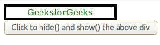
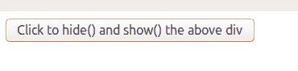

# jQuery | toggle()方法

> 原文:[https://www.geeksforgeeks.org/jquery-toggle-method/](https://www.geeksforgeeks.org/jquery-toggle-method/)

**切换()**方法用于检查所选元素的可见性，以在所选元素的隐藏()和显示()之间切换。

*   当元素隐藏时，show()运行。
*   元素可见时运行 hide()。

**语法:**

> $(选择器)。切换(速度、放松、回调)

**参数:**有三个可选参数:

*   **速度:**用于指定拨动效果的速度。它可以以毫秒为单位，缓慢或快速。
*   **缓和:**用于指定元素在动画不同点的速度。
*   **回调:**切换效果后立即调用的函数。

下面是显示 toggle()方法的示例:

```
<!DOCTYPE html>
<html>

<head>
    <script src=
"https://ajax.googleapis.com/ajax/libs/jquery/3.3.1/jquery.min.js">
    </script>
    <script>
        $(document).ready(function() {
            $("button").click(function() {
                $("#gfg").toggle();
            });
        });
    </script>
    <style>
        #gfg {
            color: green;
            border: 5px solid black;
            width: 200px;
            text-align: center;
        }
    </style>
    </style>
</head>

<body>

    <div id="gfg">GeeksforGeeks</div>

    <button>Click to hide() and show() the above div</button>

</body>

</html>
```

**输出:**
点击按钮前:


点击按钮后:


再次点击按钮后:
